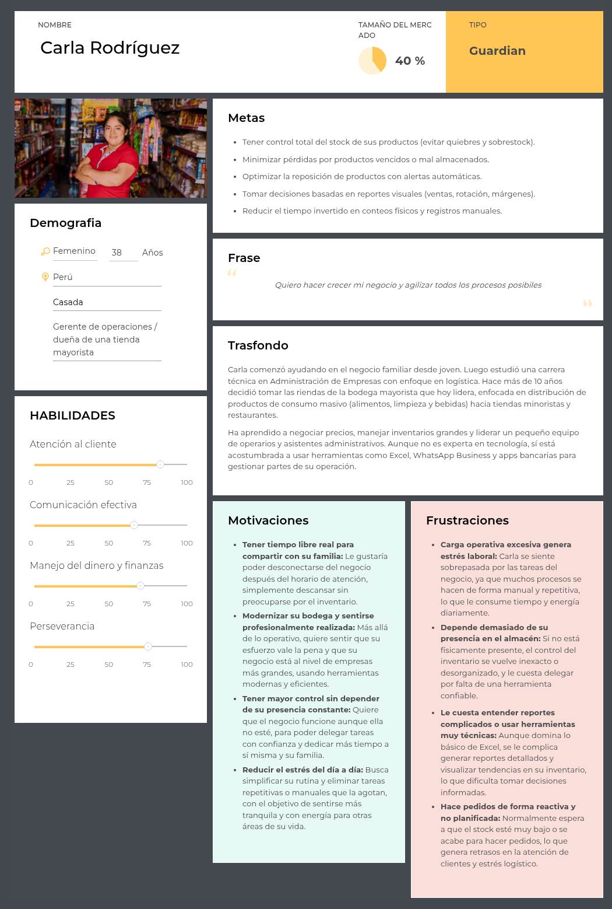
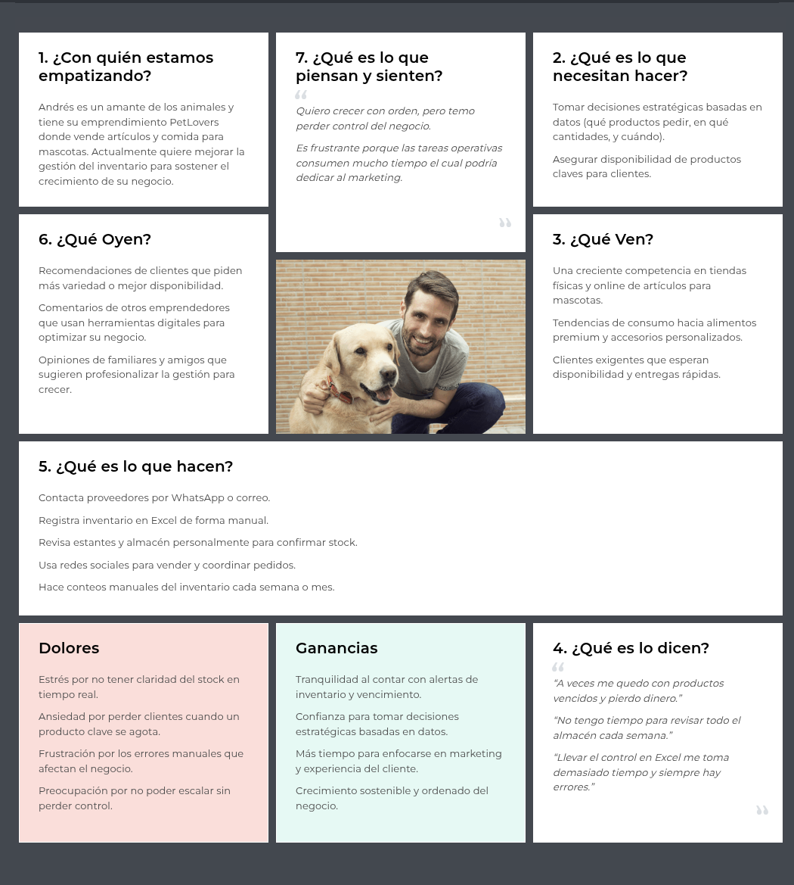
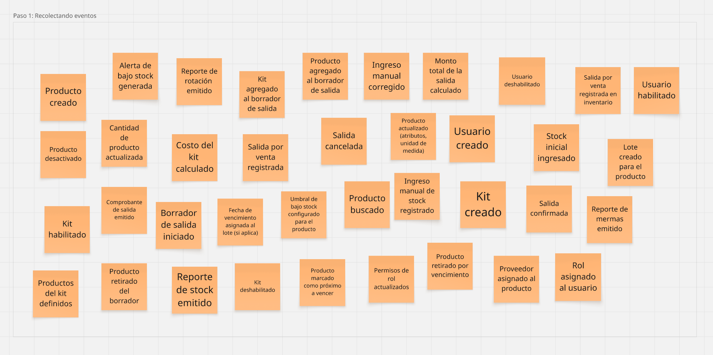
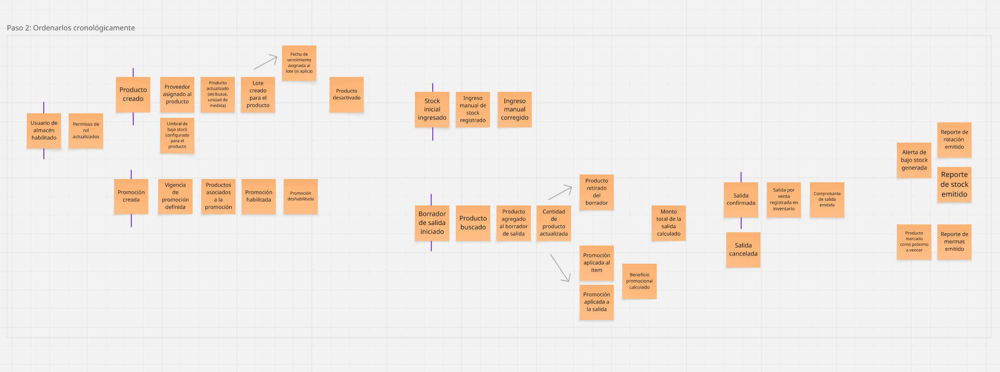
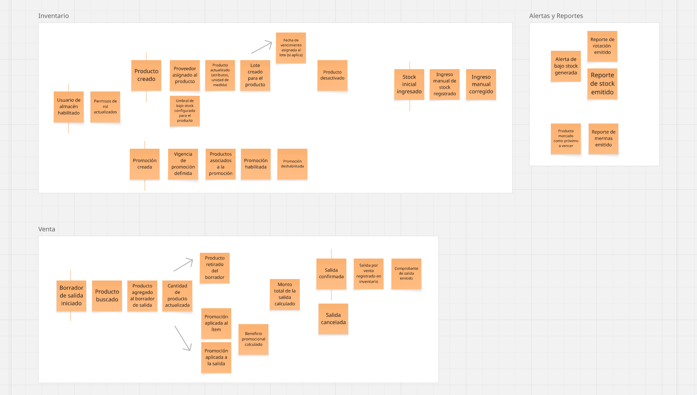

# 
Project Report

    <strong>Universidad Peruana de Ciencias Aplicadas</strong> 
    </img> 
    <strong>Ingeniería de Software - 2025-20</strong> 
    <strong>Desarrollo de Aplicaciones Open Source - 7391</strong> 
    <strong>Profesor: Hugo Allan Mori Paiva</strong> 
     <strong>Informe del Trabajo Final</strong>

    <strong>Startup: Inventiapp</strong> 
    <strong>Producto: StockTrack</strong>

    <h3 align="center">Team Members:</h3>
    <table align="center">
        <tr>
            <th style="text-align:center;">Member</th>
            <th style="text-align:center;">Code</th>
        </tr>
        <tr>
            <td>Vanessa May Lang Choy Robles</td>
            <td>U202317450</td>
        </tr>
        <tr>
            <td>María Patricia Hernández Uchuya</td>
            <td>U202311258</td>
        </tr>
        <tr>
            <td>Dayro Richard Rios Piñan</td>
            <td>U202315283</td>
        </tr>
        <tr>
            <td>Fabiola Del Rocio Saldaña Ayala</td>
            <td>U202313773</td>
        </tr>
        <tr>
            <td>Piero Angel Sulca Sanchez</td>
            <td>U202423711</td>
        </tr>
    </table>

 

    <strong>Septiembre, 2025</strong>

    <h1 align="center">Registro de versiones del Informe</h1>
     
    <table align="center">
        <tr>
            <th>Versión</th>
            <th>Fecha</th>
            <th>Autor</th>
            <th>Descripción de modificaciones</th>
        </tr>
        <tr>
            <td>0</td>
            <td>3/09/2025</td>
            <td>María Hernández</td>
            <td>Creación del reporte.</td>
        </tr>
    </table>

# Project Report Collaboration Insights
Link del repositorio del reporte: https://github.com/Inventiapp/workstation-markdown  

# Contenido
[Student Outcome](#student-outcome)

- [Project Report](#project-report)
- [Project Report Collaboration Insights](#project-report-collaboration-insights)
- [Contenido](#contenido)
- [Student Outcome](#student-outcome)
- [Capítulo I: Presentación](#capítulo-i-presentación)
  - [1.1. Startup Profile](#11-startup-profile)
    - [1.1.1. Descripción de la Startup](#111-descripción-de-la-startup)
    - [1.1.2. Perfiles de integrantes del equipo](#112-perfiles-de-integrantes-del-equipo)
  - [1.2. Solution Profile](#12-solution-profile)
    - [1.2.1. Antecedentes y problemática](#121-antecedentes-y-problemática)
    - [1.2.2. Lean UX Process](#122-lean-ux-process)
      - [1.2.2.1. Lean UX Problem Statements](#1221-lean-ux-problem-statements)
      - [1.2.2.2. Lean UX Assumptions](#1222-lean-ux-assumptions)
      - [1.2.2.3. Lean UX Hypothesis Statements](#1223-lean-ux-hypothesis-statements)
      - [1.2.2.4. Lean UX Canvas](#1224-lean-ux-canvas)
  - [1.3. Segmentos objetivo](#13-segmentos-objetivo)
- [Capítulo II: Requirements Elicitation \& Analysis](#capítulo-ii-requirements-elicitation--analysis)
  - [2.1. Competidores](#21-competidores)
    - [2.1.1. Análisis competitivo](#211-análisis-competitivo)
    - [2.1.2. Estrategias y tácticas frente a competidores](#212-estrategias-y-tácticas-frente-a-competidores)
  - [2.2. Entrevistas](#22-entrevistas)
    - [2.2.1. Diseño de entrevistas](#221-diseño-de-entrevistas)
    - [2.2.2. Registro de entrevistas](#222-registro-de-entrevistas)
    - [2.2.3. Análisis de entrevistas](#223-análisis-de-entrevistas)
  - [2.3. Needfinding](#23-needfinding)
    - [2.3.1. User Personas](#231-user-personas)
    - [2.3.2. User Task Matrix](#232-user-task-matrix)
    - [2.3.3. User Journey Mapping](#233-user-journey-mapping)
    - [2.3.4. Empathy Mapping](#234-empathy-mapping)
  - [2.4. Big Picture Event Storming](#24-big-picture-event-storming)
  - [2.5. Ubiquitous Language](#25-ubiquitous-language)
- [Capítulo III: Requirements Specification](#capítulo-iii-requirements-specification)
  - [3.1. User Stories](#31-user-stories)
  - [3.2. Impact Mapping](#32-impact-mapping)
  - [3.3. Product Backlog](#33-product-backlog)
- [Capítulo IV: Product Design](#capítulo-iv-product-design)
  - [4.1. Style Guidelines.](#41-style-guidelines)
    - [4.1.1. General Style Guidelines](#411-general-style-guidelines)
    - [4.1.2. Web Style Guidelines](#412-web-style-guidelines)
  - [4.2. Information Architecture.](#42-information-architecture)
    - [4.2.1. Organization Systems.](#421-organization-systems)
    - [4.2.2. Labeling Systems.](#422-labeling-systems)
    - [4.2.3. SEO Tags and Meta Tags](#423-seo-tags-and-meta-tags)
    - [4.2.4. Searching Systems.](#424-searching-systems)
    - [4.2.5. Navigation Systems.](#425-navigation-systems)
  - [4.3. Landing Page UI Design.](#43-landing-page-ui-design)
    - [4.3.1. Landing Page Wireframe.](#431-landing-page-wireframe)
    - [4.3.2. Landing Page Mock-up.](#432-landing-page-mock-up)
  - [4.4. Web Applications UX/UI Design.](#44-web-applications-uxui-design)
    - [4.4.1. Web Applications Wireframes.](#441-web-applications-wireframes)
    - [4.4.2. Web Applications Wireflow Diagrams.](#442-web-applications-wireflow-diagrams)
    - [4.4.2. Web Applications Mock-ups.](#442-web-applications-mock-ups)
    - [4.4.3. Web Applications User Flow Diagrams.](#443-web-applications-user-flow-diagrams)
  - [4.5. Web Applications Prototyping.](#45-web-applications-prototyping)
  - [4.6. Domain-Driven Software Architecture.](#46-domain-driven-software-architecture)
    - [4.6.1. Design-Level Event Storming.](#461-design-level-event-storming)
    - [4.6.2. Software Architecture Context Diagram.](#462-software-architecture-context-diagram)
    - [4.6.3. Software Architecture Container Diagrams.](#463-software-architecture-container-diagrams)
    - [4.6.4. Software Architecture Components Diagrams.](#464-software-architecture-components-diagrams)
  - [4.7. Software Object-Oriented Design.](#47-software-object-oriented-design)
    - [4.7.1. Class Diagrams.](#471-class-diagrams)
  - [4.8. Database Design.](#48-database-design)
    - [4.8.1. Database Diagrams](#481-database-diagrams)
- [Capítulo V: Product Implementation, Validation \& Deployment](#capítulo-v-product-implementation-validation--deployment)
  - [5.1. Software Configuration Management.](#51-software-configuration-management)
    - [5.1.1. Software Development Environment Configuration.](#511-software-development-environment-configuration)
    - [5.1.2. Source Code Management.](#512-source-code-management)
    - [5.1.3. Source Code Style Guide \& Conventions.](#513-source-code-style-guide--conventions)
    - [5.1.4. Software Deployment Configuration.](#514-software-deployment-configuration)
  - [5.2. Landing Page, Services \& Applications Implementation.](#52-landing-page-services--applications-implementation)
    - [5.2.1. Sprint 1](#521-sprint-1)
      - [5.2.1.1. Sprint Planning 1.](#5211-sprint-planning-1)
      - [5.2.1.2. Aspect Leaders and Collaborators.](#5212-aspect-leaders-and-collaborators)
      - [5.2.1.3. Sprint Backlog 1.](#5213-sprint-backlog-1)
      - [5.2.1.4. Development Evidence for Sprint Review.](#5214-development-evidence-for-sprint-review)
      - [5.2.1.5. Execution Evidence for Sprint Review.](#5215-execution-evidence-for-sprint-review)
      - [5.2.1.6. Services Documentation Evidence for Sprint Review.](#5216-services-documentation-evidence-for-sprint-review)
      - [5.2.1.7. Software Deployment Evidence for Sprint Review.](#5217-software-deployment-evidence-for-sprint-review)
      - [5.2.1.8. Team Collaboration Insights during Sprint](#5218-team-collaboration-insights-during-sprint)
- [Conclusiones](#conclusiones)
  - [Conclusiones y recomendaciones](#conclusiones-y-recomendaciones)
- [Bibliografía](#bibliografía)
- [Anexos](#anexos)

# Student Outcome

# Capítulo I: Presentación

## 1.1. Startup Profile
### 1.1.1. Descripción de la Startup

StockTrack es una aplicación innovadora que busca optimizar la gestión de inventarios en bodegas y almacenes, brindando a los negocios una herramienta sencilla, confiable y en tiempo real para controlar el ingreso y salida de productos. La plataforma permite registrar movimientos de stock de manera automatizada, generar alertas inteligentes en caso de niveles bajos o próximos vencimientos, visualizar la información centralizada de cada producto y acceder a reportes con analíticas que facilitan la toma de decisiones estratégicas. Con ello, StockTrack elimina la dependencia de procesos manuales, reduce errores humanos, evita pérdidas por sobrestock o desabastecimiento y mejora la eficiencia operativa, impulsando así la rentabilidad y el crecimiento de las empresas.

### 1.1.2. Perfiles de integrantes del equipo

<table align="center" border="1" cellspacing="0" cellpadding="8" style="page-break-inside: avoid; width: 90%; border-collapse: collapse;">
  <tr>
    <td style="width: 150px; text-align: center;">
      
    </td>
      <td>
          
<strong>Vanessa May Lang Choy Robles - U202317450</strong>

          

            Soy una estudiante responsable con el trabajo. Respeto y escucho la opinión de los demás ayudando al trabajo en equipo. Me comprometo a contribuir al equipo siendo puntual en las reuniones y responsable en las entregas.
          

    </td>
  </tr>
</table>
 
<table align="center" border="1" cellspacing="0" cellpadding="8" style="page-break-inside: avoid; width: 90%; border-collapse: collapse;">
  <tr>
    <td style="width: 150px; text-align: center;">
      
    </td>
      <td>
          
<strong>María Patricia Hernández Uchuya - U202311258</strong>

          

            Estudio la carrera de Ingeniería de Software, tengo 19 años y actualmente me encuentro cursando el sexto ciclo de dicha carrera. Tengo conocimientos en C++, C#, Python, Java, HTML, CSS, JavaScript y Vue. Me considero una persona con responsabilidad, optimismo y honestidad, cualidades que considero fundamentales para una colaboración efectiva en equipo y un buen desarrollo en este proyecto.
          

    </td>
  </tr>
</table>
 
<table align="center" border="1" cellspacing="0" cellpadding="8" style="page-break-inside: avoid; width: 90%; border-collapse: collapse;">
  <tr>
    <td style="width: 150px; text-align: center;">
      
    </td>
      <td>
          
<strong>Dayro Richard Rios Piñan - U202315283</strong>

          

            Mi nombre es Dayro Ríos, tengo 19 años, estoy cursando el sexto ciclo de la carrera de Ingeniería de Software en la Universidad Peruana de Ciencias Aplicadas. Tengo conocimientos en los lenguajes de programación c++, python, html y css, además gestores de base de datos como mssql. Cuando trabajo en equipo soy comunicativo, responsable y trato de realizar el trabajo lo mejor posible. 
          

    </td>
  </tr>
</table>
 
<table align="center" border="1" cellspacing="0" cellpadding="8" style="page-break-inside: avoid; width: 90%; border-collapse: collapse;">
  <tr>
    <td style="width: 150px; text-align: center;">
      
    </td>
      <td>
          
<strong>Fabiola Del Rocio Saldaña Ayala - U202313773</strong>

          

            Mi nombre es Fabiola Saldaña, tengo 19 años y actualmente curso el 6to ciclo de la carrera de Ingeniería de Software. En lo personal busco aprender constantemente y me considero alguien responsable, proactiva y dedicada con mis trabajos. Es por ello que me comprometo apoyar al equipo con mis habilidades y conocimientos para alcanzar los mejores resultados.
          

    </td>
  </tr>
</table>
 
<table align="center" border="1" cellspacing="0" cellpadding="8" style="page-break-inside: avoid; width: 90%; border-collapse: collapse;">
  <tr>
    <td style="width: 150px; text-align: center;">
      
    </td>
      <td>
          
<strong>Piero Angel Sulca Sanchez - U202423711</strong>

          

             Curso la carrera de Ingeniería de Software y tengo experiencia en desarrollo web, trabajando con equipos pequeños. Me gusta el Front End, en especial el diseño de interfaces 3D y productos creativos. Tengo conocimientos que pueden ayudar al equipo como levantamiento de requerimientos, diseño de interfaces, desarrollo web (React, Typescript), diseño de bases de datos y las habilidades de organización y colaboración en equipos pequeños.
          

    </td>
  </tr>
</table>
 

## 1.2. Solution Profile
### 1.2.1. Antecedentes y problemática

**What (Qué)**

- ¿Cuál es el problema? 
El problema principal es la falta de control en los inventarios de bodegas y almacenes, lo que genera pérdidas por vencimiento de productos, errores en el registro manual de entradas y salidas, y retrasos en la reposición de stock. Muchas empresas aún dependen de hojas de cálculo o procesos manuales que no reflejan la situación en tiempo real.

- ¿Cuál es la relación con la persona en cuestión? 
El problema afecta directamente a dueños de negocios, administradores de almacenes y encargados de logística, quienes necesitan herramientas confiables para evitar quiebres de stock o sobreacumulación. StockTrack se convierte en un aliado para optimizar su gestión y reducir riesgos.

**When (Cuándo)**

- ¿Cuándo sucede el problema? 
El problema ocurre en el momento en que se registran entradas o salidas de productos y no hay un sistema automatizado que actualice la información en tiempo real. Esto puede darse diariamente, con cada movimiento de mercadería.

- ¿Cuándo utiliza el cliente el producto? 
El cliente utiliza StockTrack en todo momento que gestiona inventario, al recibir un nuevo lote, al realizar ventas o despachos, al planificar compras, e incluso al revisar reportes para la toma de decisiones estratégicas.

**Where (dónde)**

- ¿Dónde está el cliente cuando usa el producto? 
El cliente generalmente se encuentra dentro de la bodega o almacén, donde se realizan los movimientos físicos de los productos, o en su oficina, desde donde consulta los reportes y analíticas.

- ¿A dónde se dirige? 
El cliente se dirige a digitalizar sus procesos y a tener un mayor control de su inventario con datos confiables y centralizados, accesibles en cualquier momento y lugar.

- ¿Dónde surge el problema? 
El problema surge en los puntos críticos del control de inventario, tales como la falta de trazabilidad en los registros manuales, la ausencia de alertas automáticas y la desconexión entre la gestión operativa y la planificación estratégica.

**Who (quién)**

- ¿Quiénes están involucrados? 
Están involucrados dueños de negocios, jefes de almacén, encargados de logística y el personal que manipula y registra el stock en la bodega.

- ¿A quiénes le sucede el problema? 
El problema le sucede tanto a pequeños y medianos empresarios como a grandes almacenes que carecen de un sistema confiable para controlar su inventario en tiempo real.

- ¿Quién lo utilizará? 
El sistema será utilizado principalmente por administradores de almacén y personal operativo, pero también beneficiará a los gerentes y dueños, quienes tendrán acceso a reportes y analíticas centralizadas.

**Why (por qué)**

- ¿Cuál es la causa del problema? 
La causa principal es la dependencia de procesos manuales o de sistemas desactualizados que no permiten el registro automatizado ni generan alertas preventivas. Esto provoca errores humanos, retrasos en la reposición, y pérdidas por vencimientos o robos no detectados a tiempo.

**How (cómo)**
- ¿En qué condiciones los clientes usan nuestro producto? 
Los clientes usan StockTrack en un entorno de trabajo dinámico y operativo, donde es necesario registrar movimientos de stock de manera rápida y sencilla. Lo utilizan desde dispositivos móviles o computadoras para que la información se actualice en tiempo real.

- ¿Cómo nos conocieron los compradores? 
Los compradores conocen StockTrack a través de recomendaciones de otros negocios, redes sociales y campañas digitales enfocadas en la optimización de procesos logísticos. También por demostraciones en ferias o eventos de tecnología empresarial.

- ¿Cómo prefieren los lectores acceder a nuestro contenido? 
Los clientes prefieren acceder al sistema mediante una aplicación web intuitiva y fácil de usar, complementada con alertas inteligentes vía correo electrónico o notificaciones móviles.

- ¿Qué llevó a la persona a llegar a esta situación? 
La persona llegó a esta situación por la necesidad de controlar mejor su inventario, evitar pérdidas económicas y tener mayor seguridad y confiabilidad en la gestión de sus productos.

**How much (cuánto)**

Según un estudio realizado por GS1 Uruguay (2024), el porcentaje de productos no encontrados en góndolas alcanzó el 7.08 %, lo que representa un aumento del 74 % respecto al año anterior; este dato indica que por cada 100 productos auditados, 7 no estaban disponibles, evidenciando el impacto directo que una gestión ineficiente de inventarios puede tener en la disponibilidad, las ventas y la experiencia del cliente.

### 1.2.2. Lean UX Process
#### 1.2.2.1. Lean UX Problem Statements

Nuestro servicio ofrece a las bodegas y almacenes una plataforma innovadora para gestionar inventarios en tiempo real, permitiendo registrar movimientos de stock, generar alertas inteligentes, centralizar información de productos y acceder a reportes analíticos que apoyan la toma de decisiones estratégicas.

Hemos observado un factor crítico que afecta la eficiencia de los negocios y esto radica en que actualmente muchas empresas siguen utilizando procesos manuales, como hojas de cálculo o registros en papel para controlar su inventario. Esto provoca errores humanos frecuentes, falta de visibilidad en tiempo real, pérdidas por sobrestock o desabastecimiento y retrasos en la identificación de productos próximos a vencerse.

¿Cómo lograr que las bodegas y almacenes adopten un sistema que automatice el control de inventario, reduzca errores humanos y mejore la eficiencia operativa sin necesidad de procesos manuales que limiten el crecimiento del negocio?

#### 1.2.2.2. Lean UX Assumptions

**Business Assumptions**

- Creo que mis clientes necesitan una forma confiable, rápida y automatizada de controlar su inventario en tiempo real para reducir errores y pérdidas económicas.
- Estas necesidades se pueden resolver con una aplicación que registre entradas y salidas de productos, genere alertas inteligentes y centralice la información en un solo panel.
- Mis clientes iniciales serán pequeñas y medianas empresas con bodegas y almacenes que actualmente usan procesos manuales (Excel, papel, o registros básicos) para su inventario.
- El valor #1 que un cliente quiere de mi servicio es evitar pérdidas y desabastecimientos a través de un control de inventario preciso y en tiempo real.
- El cliente también puede obtener los beneficios de reducción de errores humanos, ahorro de tiempo, mejor planificación de compras y reportes analíticos para decisiones estratégicas.
- Voy a adquirir la mayoría de mis clientes a través de estrategias de marketing digital, en redes sociales y/o Google Ads, asociaciones con cámaras de comercio y ventas directas B2B.
- Haré dinero a través de suscripciones mensuales o anuales, con planes escalables según el número de productos o almacenes que gestione cada cliente.
- Mi competencia principal en el mercado será otros sistemas de gestión de inventarios o soluciones locales personalizadas.
- Los venceremos debido a una interfaz más intuitiva, precios accesibles, configuración sencilla y un enfoque especializado en pymes que no pueden costear sistemas complejos.
- Mi mayor riesgo de producto es que los clientes perciban el sistema como complejo o no lo adopten porque prefieren seguir con sus métodos manuales.
- Resolveremos esto a través de una experiencia de usuario simple, capacitación inicial y soporte al cliente accesible para facilitar la adopción.

**User Assumptions**

- ¿Quién es el usuario?
Encargados de almacén, emprendedores, administradores de bodegas y dueños de pequeños negocios.

- ¿Dónde encaja nuestro producto en su trabajo o vida?
En las operaciones diarias de registro de entradas y salidas de productos, control de stock y planificación de compras.

- ¿Qué problemas tiene nuestro producto que resolver?
Errores en registros manuales, pérdida de productos por vencimiento o sobrestock, falta de información en tiempo real y dificultad para generar reportes claros.

- ¿Cuándo y cómo es nuestro producto usado?
Se usa todos los días, durante la recepción y despacho de productos, así como en reuniones de planificación donde se revisan reportes y métricas.

- ¿Qué características son importantes?
Registro rápido de productos, alertas personalizables, reportes visuales, acceso desde cualquier dispositivo y seguridad en los datos.

- ¿Cómo debe verse nuestro producto y cómo comportarse?
Debe ser intuitivo, minimalista y responsivo, fácil de aprender sin necesidad de manuales extensos, y comportarse de forma rápida, confiable y sin errores.

**Feature Assumptions**

- Creemos que la aplicación debe contar con una interfaz de usuario intuitiva y responsiva que permitirá a los encargados de almacén, emprendedores y administradores adoptarla sin dificultad, reduciendo la curva de aprendizaje.
- Creemos que la plataforma debe proporcionar notificaciones y alertas personalizables tales como stock bajo o fechas próximas de vencimiento, que mantendrán a los usuarios informados para evitar errores logísticos y quiebres de stock.
- Creemos que el sistema debe ser accesible desde la web y dispositivos móviles para asegurar disponibilidad en todo momento.
- Creemos que la seguridad en los datos es clave para generar confianza en los usuarios.

#### 1.2.2.3. Lean UX Hypothesis Statements

Creemos que implementar alertas personalizables sobre niveles bajos de stock y fechas próximas de vencimiento reducirá las pérdidas por quiebre o vencimiento de productos. 
Sabremos que hemos tenido éxito 
Cuando observemos al menos un 30% de reducción en productos vencidos o faltantes en comparación con los registros previos al uso de alertas.

Creemos que los usuarios valorarán la disponibilidad de reportes gráficos que muestren los productos más rotados, niveles de stock y tendencias de consumo. 
Sabremos que hemos tenido éxito 
Cuando al menos un 70% de los usuarios activos usen el módulo de reportes semanalmente y reporten satisfacción positiva en encuestas cualitativas.

Creemos que una interfaz intuitiva y fácil de aprender aumentará la adopción por parte de usuarios que dependen de Excel o registros manuales. 
Sabremos que hemos tenido éxito 
Cuando al menos el 60% de los nuevos clientes registren sus primeros productos dentro de las 24 horas posteriores a la activación de su cuenta.

Creemos que habilitar el acceso a la aplicación tanto desde la web como desde dispositivos móviles aumentará la frecuencia de uso. 
Sabremos que hemos tenido éxito 
Cuando el 50% de los usuarios accedan a la plataforma al menos una vez al día desde distintos dispositivos.

#### 1.2.2.4. Lean UX Canvas

## 1.3. Segmentos objetivo

Esta sección expone los segmentos vinculados al contexto del problema, integrando características demográficas y datos estadísticos que respaldan el análisis. En este sentido, y con el propósito de desarrollar un producto que se ajuste de manera efectiva a las necesidades de los clientes, **StockTrack** enfocará sus esfuerzos en los siguientes segmentos de la población.

**1. Dueños de bodegas:** Estos usuarios tienen como puesto de trabajo su bodega. Ellos buscan una solución práctica que los ayude a realizar la logística de manera más eficiente y sin errores

- Edad: 20 a 60 años
- Ocupación: Dueños de bodegas.
- País: Perú.
- Dominio: Nivel intermedio o básico en tecnología, pero familiarizados con apps móviles.
- Beneficios buscados:
    - Rápidez de cálculos logísticos.
    - Orden y administración sencilla de los productos.

**2. Startups y emprendedores en expansión con necesidades logísticas:** Estos usuarios se encuentran en una etapa de crecimiento de su negocio y requieren herramientas que les permitan profesionalizar la gestión de sus operaciones. Buscan soluciones accesibles y escalables que faciliten el control del inventario sin necesidad de invertir en sistemas costosos o complejos.

- Edad: 22 a 45 años
- Ocupación: Fundadores de startups, emprendedores y  pequeños empresarios.
- País: Perú (con potencial de expansión a otros países de Latinoamérica).
- Dominio: Nivel intermedio en el uso de herramientas digitales y aplicaciones móviles.
- Beneficios buscados:
    - Escalabilidad en el control del inventario.
    - Reducción de costos y optimización de recursos.
    - Mayor visibilidad y control en tiempo real sobre el stock.
    - Herramientas que acompañen el crecimiento del negocio sin requerir infraestructura adicional.
  

# Capítulo II: Requirements Elicitation & Analysis

## 2.1. Competidores
### 2.1.1. Análisis competitivo

  

### 2.1.2. Estrategias y tácticas frente a competidores

**Estrategias**
  

    1. Diferenciación por simplicidad y usabilidad: La solución estará enfocada en bodegas y pequeñas empresas que requieren una interfaz intuitiva y un flujo de trabajo sencillo, reduciendo la curva de aprendizaje.

    2. Accesibilidad económica: La startup ofrecerá planes escalables y accesibles, con opción gratis básica para atraer usuarios y fomentar adopción masiva.

    3. Adaptación al mercado local: Integración directa con la facturación electrónica exigida por SUNAT en Perú y soporte en español, lo cual representa una ventaja frente a soluciones globales.    

    
    4. Posicionamiento digital: Focalización en marketing digital dirigido a bodegueros y pymes mediante redes sociales, asociaciones de comerciantes y programas de referidos.

**Tácticas**
  

    1. Frente a las fortalezas de competidores: Ofrecer un onboarding rápido y gratuito que simplifique la transición a nuestro sistema. Mantener integraciones básicas con e-commerce.

    2. Frente a las debilidades de competidores: Simplificar los módulos de inventario para usuarios no técnicos. Ofrecer precios más bajos y planes sin contratos largos. Incorporar soporte técnico personalizado en español.

    3. Aprovechando oportunidades del mercado: Posicionarse como solución para la digitalización de bodegas y pequeños negocios. Diseñar versiones móviles ligeras, dado que muchos bodegueros usan smartphones como principal herramienta de gestión.

    4. Mitigando amenazas: Diferenciarse de grandes empresas destacando el enfoque local. Crear una comunidad de usuarios locales que genere lealtad frente a la entrada de nuevos competidores. Innovar constantemente incorporando módulos escalables.

## 2.2. Entrevistas

En esta sección se lleva a cabo la investigación y recopilación de información mediante entrevistas a los usuarios de cada segmento objetivo, con el propósito de comprenderlos de manera más profunda.

### 2.2.1. Diseño de entrevistas

En esta sección se plantean preguntas principales y complementarias destinadas a entrevistas con cada uno de nuestros segmentos objetivos, con el propósito de recopilar la mayor cantidad posible de información relevante. Tras un análisis detallado, se definieron las siguientes preguntas para aplicar en las entrevistas a dichos segmentos.

**Segmento #1: Bodegas especializadas por rubro**

Preguntas principales:
1. ¿Podrías describirme cómo gestionas actualmente el inventario de tu bodega?
2. ¿Cuáles consideras que son los principales desafíos al momento de organizar tus productos?
3. ¿Has enfrentado pérdidas o inconvenientes por errores en el inventario? ¿Cómo los solucionaste?
4. ¿Qué tan relevante es para ti contar con un control del stock en tiempo real?
5. ¿Empleas algún sistema o herramienta digital para la gestión? Si es así, ¿cuál utilizas y cómo ha sido tu experiencia?
6. ¿De qué manera detectas cuando un producto está por agotarse o próximo a vencer?

Preguntas complementarias:
- ¿Qué tipo de reportes o información te gustaría obtener acerca de tu inventario?
- ¿Qué navegador y sistema operativo utilizas más? ¿Qué dispositivos utilizas con mayor frecuencia en tu trabajo (laptop, celular, tablet)?
- ¿Cómo imaginas que una plataforma digital podría ayudarte a optimizar tu operación diaria?
- ¿Qué redes sociales o canales digitales empleas para vender tus productos?

**Segmento #2: Startups y emprendedores en expansión con necesidades logísticas**

Preguntas principales:
1. ¿Cómo gestionas actualmente el inventario de tu negocio?
2. ¿En qué situaciones sientes que el control del stock te limita o te hace perder tiempo?
3. ¿De qué forma registras las entradas y salidas de productos?
4. ¿Qué aspectos te gustaría mejorar en tu proceso logístico actual?
5. ¿Has evaluado implementar una plataforma para gestionar tu inventario? ¿Por qué tomarías o no esa decisión?

Preguntas complementarias:

- ¿Qué herramientas digitales utilizas actualmente en tu negocio?
- ¿Dónde se encuentran almacenados tus productos?
- ¿Con qué frecuencia necesitas revisar tu stock?
- ¿Qué redes sociales o canales digitales empleas para vender tus productos?
- ¿Qué navegador y sistema operativo utilizas más? ¿Qué dispositivos utilizas con mayor frecuencia en tu trabajo (laptop, celular, tablet)?

### 2.2.2. Registro de entrevistas

Entrevista x:

[video]

[XX:XX - XX:XX]

Duración: 

Link de la entrevista: (link acortado en algun shortener)

Nombre: 

Apellidos: 

Edad: 

Distrito:

Resumen:
### 2.2.3. Análisis de entrevistas

## 2.3. Needfinding
En el siguiente apartado, analizaremos a nuestros segmentos objetivos para identificar sus necesidades y en base a esto ofrecerles soluciones óptimas a sus problemas.

### 2.3.1. User Personas
**Segmento 1: Dueños de bodegas**

**Segmento 2: Startups y emprendedores en expansión con necesidades logísticas**

### 2.3.2. User Task Matrix

**Segmento 1: Dueños de bodegas**

| **Task Matrix**                                                     | **Frecuencia** | **Importancia** |
|----------------------------------------------------------------------|----------------|------------------|
| Supervisar el stock y revisar niveles de inventario                 | Alta           | Alta             |
| Realizar conteos físicos o auditorías manuales                      | Media          | Alta             |
| Negociar precios y coordinar con proveedores                        | Alta           | Alta             |
| Revisar reportes de ventas, rotación y márgenes                     | Media          | Alta             |
| Ingresar datos en Excel o sistemas básicos de control               | Media          | Media            |
| Delegar tareas a sus asistentes o empleados                         | Media          | Alta             |
| Atender clientes en tienda                                          | Alta           | Alta             |
| Coordinar pedidos con mayoristas o distribuidores                   | Alta           | Alta             |
| Capacitarse en nuevas herramientas tecnológicas                     | Baja           | Media            |
| Resolver errores de inventario (sobrestock, productos vencidos)  | Alta           | Alta             |

  <!-- Esto agrega espacio visual en algunas plataformas -->

**Segmento 2: Startups y emprendedores en expansión con necesidades logísticas**

| **Task Matrix**                                                                | **Frecuencia** | **Importancia** |
| ------------------------------------------------------------------------------ | -------------- | --------------- |
| Gestionar el envío y distribución de productos                                 | Alta           | Alta            |
| Coordinar con operadores logísticos y transportistas                           | Alta           | Alta            |
| Monitorear tiempos de entrega y resolver incidencias                           | Alta           | Alta            |
| Optimizar costos de transporte y almacenamiento                                | Media          | Alta            |
| Evaluar y contratar proveedores logísticos externos                            | Media          | Alta            |
| Implementar herramientas digitales para el control de logística                | Media          | Alta            |
| Revisar métricas de satisfacción del cliente respecto a entregas               | Media          | Alta            |
| Escalar la capacidad de operaciones en función de la demanda                   | Media          | Alta            |

### 2.3.3. User Journey Mapping
**Segmento 1: Dueños de bodegas**

**Segmento 2: Startups y emprendedores en expansión con necesidades logísticas**

### 2.3.4. Empathy Mapping
**Segmento 1: Dueños de bodegas**

**Segmento 2: Startups y emprendedores en expansión con necesidades logísticas**

## 2.4. Big Picture Event Storming

## 2.5. Ubiquitous Language
El siguiente glosario presenta los términos clave utilizados en el desarrollo del proyecto StockTrack. Este lenguaje común asegura que todos los miembros del equipo (técnicos y no técnicos) compartan una comprensión unificada de los conceptos centrales, facilitando la comunicación y el diseño colaborativo del sistema.

1. **Landing Page**: Página inicial de StockTrack que presenta la propuesta de valor y permite a los usuarios registrarse o iniciar sesión.

2. **Inventario**: Conjunto organizado de productos gestionados dentro de la plataforma, que incluye información como cantidades disponibles, ubicación en la bodega, lotes y fechas de vencimiento.

3. **Producto**: Unidad básica registrada en el sistema. Cada producto posee atributos como nombre, descripción, categoría, unidades de medida, stock mínimo y fecha de vencimiento.

4. **Stock**: Cantidad disponible de un producto específico dentro del inventario.

5. **Stock mínimo**: Nivel definido por el usuario que representa la cantidad mínima aceptable de un producto antes de requerir reposición.

6. **Stock bajo**: Estado de un producto cuyo nivel de stock ha alcanzado o está por debajo del stock mínimo definido.

7. **Panel de Control**: Interfaz principal de la plataforma que centraliza la visualización de métricas clave (inventario disponible, alertas de stock bajo, movimientos recientes y reportes).

8. **Movimiento de Inventario**: Registro de cualquier variación en las existencias de productos, incluyendo entradas (compras o reposiciones), salidas (ventas, pérdidas o devoluciones) y ajustes manuales.

9. **Reporte**: Representación visual o estadística generada por el sistema que resume información relevante del inventario (rotación de productos, quiebres de stock, productos próximos a vencer, etc.).

10. **Bodega**: Pequeño negocio de venta de productos de consumo diario, principalmente alimentos, bebidas y artículos de primera necesidad.

11. **Dueña/o de bodega**: Usuario que gestiona directamente la operación de su bodega y utiliza StockTrack para optimizar el control de inventario, evitar pérdidas y mejorar la eficiencia.

12. **Emprendedor/a**: Usuario en etapa de crecimiento que gestiona uno o más puntos de venta y requiere profesionalizar su gestión logística con herramientas digitales.

13. **Proveedor**: Persona o empresa que abastece a las bodegas o emprendedores con productos que serán registrados y gestionados en StockTrack.

14. **Pedido**: Solicitud de reposición o compra de productos hecha a un proveedor, ya sea de forma manual o asistida por las recomendaciones del sistema.

15. **Alerta**: Notificación generada automáticamente por el sistema cuando ocurre un evento relevante (stock bajo, productos próximos a vencer, quiebre de stock, etc.).

# Capítulo III: Requirements Specification

## 3.1. User Stories

## 3.2. Impact Mapping

.

## 3.3. Product Backlog

# Capítulo IV: Product Design

## 4.1. Style Guidelines.
### 4.1.1. General Style Guidelines

**Branding**

Para nuestro logo, hemos implementado símbolos que reflejan el propósito central de StockTrack: la gestión eficiente y confiable del inventario. El logo de StockTrack proyecta una identidad sólida y práctica, alineada con su misión de brindar una solución tecnológica sencilla pero poderosa para la gestión de inventarios.

La caja representa de manera clara y universal el concepto de mercancía, almacenaje y stock, siendo el núcleo del negocio de bodegas y almacenes. El check verde simboliza control, seguridad y validación, transmitiendo la idea de que los productos están siempre bajo seguimiento y en orden.

El conjunto visual comunica simplicidad, confiabilidad y modernidad, reforzando el objetivo de StockTrack de ayudar a las bodegas a mantener su inventario bajo control, reducir errores y optimizar procesos.

La paleta de colores combina tonos cálidos (naranja/amarillo) que evocan dinamismo, accesibilidad y cercanía con el usuario, junto con un verde que transmite seguridad, éxito y confianza.

  

**Tipografía**

- Fuente principal:

Nuestra fuente principal es Open Sauce, la cual aporta un estilo sólido y moderno que transmite fuerza, confiabilidad y profesionalismo. Perfecta para logotipos y títulos de alta relevancia, esta tipografía está diseñada para proyectar claridad y autoridad visual. Uso exclusivamente para el logo y títulos principales. Estilo: Mayúsculas, Bold, tamaño 64px.

- Fuente secundaria:

La fuente secundaria utilizada es Roboto, la cual aporta legibilidad y neutralidad en interfaces digitales. Su estilo limpio y curvo facilita la lectura continua en pantallas, ideal para textos extensos, descripciones y datos de inventario. Uso en párrafos, subtítulos, descripciones y etiquetas dentro de la aplicación.

- Jerarquía tipográfica: 

Tamaño variable según jerarquía de texto (H1: títulos principales (32px, bold), H2: subtítulos (24px, semibold), Párrafos: 16px, regular, Notas/etiquetas: 12px). Asegura una visualización cómoda y ordenada.

  

**Colores**
 

La paleta de colores de StockTrack fue diseñada para transmitir energía, confianza y control en la gestión de inventarios.

-Colores principales: Naranja (#FFA22A): Representa dinamismo, accesibilidad y cercanía con el usuario evocando movimiento y acción. Amarillo (#FFC64D): Simboliza optimismo y rapidez, reforzando la idea de eficiencia en procesos. Se emplean como colores principales en el logo y en elementos destacados de la interfaz (botones de acción, iconografía principal). Verde (#2ECC71): Asociado al éxito, la validación y la seguridad. Refuerza el concepto de control y precisión en el stock, se reserva para estados positivos, alertas de stock correcto o validaciones (check, confirmaciones).

- Colores secundarios: Gris oscuro (#333333): Usado en tipografía y detalles, transmite seriedad y profesionalismo. Blanco (#FFFFFF): Representa simplicidad y claridad visual. Conforman la base de la tipografía y fondos, asegurando contraste y legibilidad en cualquier dispositivo.

  

**Spacing**

El espaciado juega un rol fundamental en la experiencia de usuario, asegurando legibilidad, orden y consistencia visual en todas las interfaces de StockTrack. Hemos definido un sistema de espaciado que será utilizado en la aplicación web.

| Elemento                        | Peso          | Tamaño          | Line height | Notas                                                    |
| :------------------------------ | :------------ | :-------------- | :---------- | :------------------------------------------------------- |
| **H1 (títulos)**                | Bold 700      | 48px            | 110% – 120% | Espaciado adicional de +0.5px para mayor impacto visual. |
| **H2 – H3 (secciones)**         | Semi-Bold 600 | 32px – 40px     | 120% – 130% | Claridad visual, adecuado para encabezados intermedios.  |
| **H4 – H5 (subtítulos)**        | Medium 500    | 24px            | 130% – 140% | Transiciones suaves entre secciones y subsecciones.      |
| **Body text (texto principal)** | Regular 400   | 16px – 18px     | 150% – 160% | Legible y cómodo para párrafos largos.                   |
| **Botones / CTAs**              | Semi-Bold 600 | 16px            | 120%        | Uso de mayúsculas opcionales para dar fuerza visual.     |

**Tono de comunicación**

- Lenguaje: Claro, cercano y profesional.    

- Formal/Casual: Casual, pero con respeto hacia los usuarios.

- Divertido/Serio: Equilibrio entre serio y entusiasta.

- Respetuoso/Irreverente: Respetuoso con un toque de humor ligero cuando sea apropiado.

- Entusiasta/Sereno: Entusiasta, motivando a los usuarios a participar en debates y predicciones.

  

### 4.1.2. Web Style Guidelines

DISEÑO RESPONSIVE:

- El diseño se adaptará automáticamente al tamaño de la pantalla.

COMPONENTES VISUALES: 

- Botones: Redondeados con 10px de radio. Cambian de color y tienen un efecto de sombra al usarse.

- Formularios: Cajas de texto con bordes suaves y sombreados ligeros, 40px. de alto.

- Links: En azul (#0000FF), subrayado. Subrayado, con color de cambio a azul oscuro  (#00008E).

- Navegación: Menú superior: Con enlaces a las principales secciones.

      

## 4.2. Information Architecture.
### 4.2.1. Organization Systems.
### 4.2.2. Labeling Systems.
### 4.2.3. SEO Tags and Meta Tags
### 4.2.4. Searching Systems.
### 4.2.5. Navigation Systems.

## 4.3. Landing Page UI Design.
### 4.3.1. Landing Page Wireframe.
### 4.3.2. Landing Page Mock-up.

## 4.4. Web Applications UX/UI Design.
### 4.4.1. Web Applications Wireframes.
### 4.4.2. Web Applications Wireflow Diagrams.
### 4.4.2. Web Applications Mock-ups.
### 4.4.3. Web Applications User Flow Diagrams.

## 4.5. Web Applications Prototyping.

## 4.6. Domain-Driven Software Architecture.
### 4.6.1. Design-Level Event Storming.
### 4.6.2. Software Architecture Context Diagram.
### 4.6.3. Software Architecture Container Diagrams.
### 4.6.4. Software Architecture Components Diagrams.

## 4.7. Software Object-Oriented Design.
### 4.7.1. Class Diagrams.

## 4.8. Database Design.
### 4.8.1. Database Diagrams

# Capítulo V: Product Implementation, Validation & Deployment

## 5.1. Software Configuration Management.
### 5.1.1. Software Development Environment Configuration.

| Producto         | Propósito en el proyecto                                | Categoría                   | Ruta de descarga/acceso                                                          | Descripción                                                                                                        |
| ---------------- | ------------------------------------------------------- | --------------------------- | -------------------------------------------------------------------------------- | ------------------------------------------------------------------------------------------------------------------ |
| **OpenJDK**      | Ejecución y compilación de aplicaciones Java            | Software Development        | [https://jdk.java.net/](https://jdk.java.net/)                                   | Implementación de código abierto del JDK, necesaria para compilar y ejecutar aplicaciones backend con Spring Boot. |
| **Maven**        | Automatización de compilación y gestión de dependencias | Software Development        | [https://maven.apache.org/](https://maven.apache.org/)                           | Herramienta para gestionar dependencias y construir proyectos Java, ampliamente utilizada con Spring Boot.         |
| **Spring Boot**  | Desarrollo simplificado de microservicios y APIs REST   | Software Development        | [https://spring.io/projects/spring-boot](https://spring.io/projects/spring-boot) | Framework que acelera el desarrollo de servicios backend y APIs con configuración mínima.                          |
| **VS Code**      | Edición y desarrollo rápido de frontend                 | Software Development        | [https://code.visualstudio.com/](https://code.visualstudio.com/)                 | Editor ligero con extensiones para Angular, TypeScript, HTML y CSS, útil para desarrollo ágil.                     |
| **Angular CLI**  | Gestión del ciclo de vida de aplicaciones Angular       | Software Development        | [https://angular.io/cli](https://angular.io/cli)                                 | Interfaz de línea de comandos para generar y administrar componentes, servicios y módulos en Angular.              |
| **Postman**      | Pruebas y validación de APIs REST                       | Software Development        | [https://www.postman.com/](https://www.postman.com/)                             | Herramienta para probar endpoints y documentar APIs de forma colaborativa.                                         |
| **Figma**        | Diseño UI/UX y prototipado de interfaces                | Product UX/UI Design        | [https://figma.com/](https://figma.com/)                                         | Plataforma colaborativa para diseño de interfaces, integración de prototipos y handoff a desarrollo.               |
| **Lucidchart**   | Modelado de procesos y diagramas de arquitectura        | Product UX/UI Design        | [https://www.lucidchart.com/](https://www.lucidchart.com/)                       | Herramienta de diagramación para flujos de procesos, arquitecturas y casos de uso.                                 |
| **Firebase**     | Servicios de backend en la nube                         | Software Development        | [https://firebase.google.com/](https://firebase.google.com/)                     | Plataforma de Google que ofrece autenticación, base de datos NoSQL y hosting para el proyecto.                     |
| **GitHub**       | Control de versiones y repositorios del proyecto        | Project Management / DevOps | [https://github.com/](https://github.com/)                                       | Plataforma para almacenar el código fuente, gestionar ramas y colaborar en equipo.                                 |
| **Google Drive** | Gestión de documentación colaborativa                   | Documentation               | [https://drive.google.com/](https://drive.google.com/)                           | Almacenamiento y edición colaborativa de documentos, reportes y manuales del sistema.                              |

### 5.1.2. Source Code Management.

El proyecto StockTrack aplica GitHub como plataforma de control de versiones bajo el modelo GitFlow, lo que garantiza la trazabilidad del código, colaboración organizada y estabilidad en cada release.

GitHub: https://github.com/Inventiapp 

Ramas principales:
- main: Contiene la versión estable y en producción.
- develop: Rama de integración de nuevas funcionalidades.

Ramas secundarias:
- feature/<nombre> → Ramas temporales para funciones especificas 

Versionado: Se emplea Semantic Versioning (SemVer 2.0.0) en el formato MAJOR.MINOR.PATCH.

Todas las integraciones hacia develop o main requieren Pull Requests revisados por al menos un miembro del equipo.

### 5.1.3. Source Code Style Guide & Conventions.

El proyecto mantiene una guía de estilo de código uniforme para mejorar la legibilidad, mantenibilidad y colaboración en equipo.

Lenguaje: Todos los identificadores, comentarios y documentación estarán en inglés.

Backend (Java con Spring Boot)
- Nombres de clases → PascalCase (ej: StockService)
- Métodos y variables → camelCase (ej: calculateTotalStock)
- Constantes → UPPER_SNAKE_CASE (ej: MAX_STOCK_LIMIT)
- Paquetes organizados por funcionalidad (controller, service, repository, model).

Frontend (Angular con TypeScript, HTML, CSS)
- Estándares: Angular Style Guide
- Componentes y clases → PascalCase (ej: InventoryComponent)
- Archivos → kebab-case (ej: inventory-list.component.ts)
- Variables y métodos → camelCase
- Uso de programación reactiva con RxJS y principios SOLID en componentes.

HTML / CSS
- Archivos → kebab-case (ej: main-layout.css)
- Clases CSS → en inglés y descriptivas (ej: .inventory-card)
- Uso de etiquetas semánticas
  
Convenciones generales
- Commits claros y cortos bajo Conventional Commits.

### 5.1.4. Software Deployment Configuration.

## 5.2. Landing Page, Services & Applications Implementation.
### 5.2.1. Sprint 1
#### 5.2.1.1. Sprint Planning 1.
#### 5.2.1.2. Aspect Leaders and Collaborators.
#### 5.2.1.3. Sprint Backlog 1.
#### 5.2.1.4. Development Evidence for Sprint Review.
#### 5.2.1.5. Execution Evidence for Sprint Review.
#### 5.2.1.6. Services Documentation Evidence for Sprint Review.
#### 5.2.1.7. Software Deployment Evidence for Sprint Review.
#### 5.2.1.8. Team Collaboration Insights during Sprint

# Conclusiones
## Conclusiones y recomendaciones

# Bibliografía

# Anexos

Link del Repositorio del Informe: https://github.com/Inventiapp/workstation-markdown  
Link del Repositorio del Proyecto:  
Link del Repositorio del Backend:  
