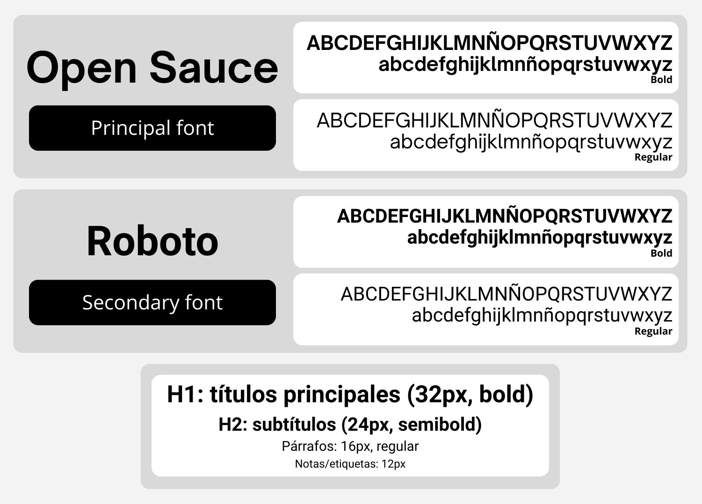
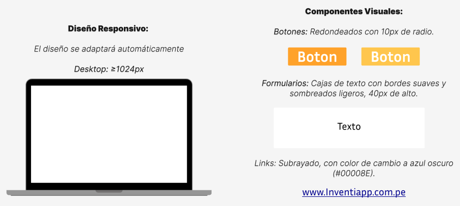

# 
Project Report

    <strong>Universidad Peruana de Ciencias Aplicadas</strong> 
    </img> 
    <strong>Ingeniería de Software - 2025-20</strong> 
    <strong>Desarrollo de Aplicaciones Open Source - 7391</strong> 
    <strong>Profesor: Hugo Allan Mori Paiva</strong> 
     <strong>Informe del Trabajo Final</strong>

    <strong>Startup: Inventiapp</strong> 
    <strong>Producto: StockTrack</strong>

    <h3 align="center">Team Members:</h3>
    <table align="center">
        <tr>
            <th style="text-align:center;">Member</th>
            <th style="text-align:center;">Code</th>
        </tr>
        <tr>
            <td>Vanessa May Lang Choy Robles</td>
            <td>U202317450</td>
        </tr>
        <tr>
            <td>María Patricia Hernández Uchuya</td>
            <td>U202311258</td>
        </tr>
        <tr>
            <td>Dayro Richard Rios Piñan</td>
            <td>U202315283</td>
        </tr>
        <tr>
            <td>Fabiola Del Rocio Saldaña Ayala</td>
            <td>U202313773</td>
        </tr>
        <tr>
            <td>Piero Angel Sulca Sanchez</td>
            <td>U202423711</td>
        </tr>
    </table>

 

    <strong>Septiembre, 2025</strong>

    <h1 align="center">Registro de versiones del Informe</h1>
     
    <table align="center">
        <tr>
            <th>Versión</th>
            <th>Fecha</th>
            <th>Autor</th>
            <th>Descripción de modificaciones</th>
        </tr>
        <tr>
            <td>0</td>
            <td>3/09/2025</td>
            <td>María Hernández</td>
            <td>Creación del reporte.</td>
        </tr>
    </table>

# Project Report Collaboration Insights
Link del repositorio del reporte: https://github.com/Inventiapp/workstation-markdown  

# Contenido
- [Project Report](#project-report)
- [Project Report Collaboration Insights](#project-report-collaboration-insights)
- [Contenido](#contenido)
- [Student Outcome](#student-outcome)
- [Capítulo I: Presentación](#capítulo-i-presentación)
  - [1.1. Startup Profile](#11-startup-profile)
    - [1.1.1. Descripción de la Startup](#111-descripción-de-la-startup)
    - [1.1.2. Perfiles de integrantes del equipo](#112-perfiles-de-integrantes-del-equipo)
  - [1.2. Solution Profile](#12-solution-profile)
    - [1.2.1. Antecedentes y problemática](#121-antecedentes-y-problemática)
    - [1.2.2. Lean UX Process](#122-lean-ux-process)
      - [1.2.2.1. Lean UX Problem Statements](#1221-lean-ux-problem-statements)
      - [1.2.2.2. Lean UX Assumptions](#1222-lean-ux-assumptions)
      - [1.2.2.3. Lean UX Hypothesis Statements](#1223-lean-ux-hypothesis-statements)
      - [1.2.2.4. Lean UX Canvas](#1224-lean-ux-canvas)
  - [1.3. Segmentos objetivo](#13-segmentos-objetivo)
- [Capítulo II: Requirements Elicitation \& Analysis](#capítulo-ii-requirements-elicitation--analysis)
  - [2.1. Competidores](#21-competidores)
    - [2.1.1. Análisis competitivo](#211-análisis-competitivo)
    - [2.1.2. Estrategias y tácticas frente a competidores](#212-estrategias-y-tácticas-frente-a-competidores)
  - [2.2. Entrevistas](#22-entrevistas)
    - [2.2.1. Diseño de entrevistas](#221-diseño-de-entrevistas)
    - [2.2.2. Registro de entrevistas](#222-registro-de-entrevistas)
    - [2.2.3. Análisis de entrevistas](#223-análisis-de-entrevistas)
  - [2.3. Needfinding](#23-needfinding)
    - [2.3.1. User Personas](#231-user-personas)
    - [2.3.2. User Task Matrix](#232-user-task-matrix)
    - [2.3.3. User Journey Mapping](#233-user-journey-mapping)
    - [2.3.4. Empathy Mapping](#234-empathy-mapping)
  - [2.4. Big Picture Event Storming.](#24-big-picture-event-storming)
  - [2.5. Ubiquitous Language.](#25-ubiquitous-language)
- [Capítulo III: Requirements Specification](#capítulo-iii-requirements-specification)
  - [3.1. User Stories](#31-user-stories)
    - [User Stories](#user-stories)
    - [Epics](#epics)
    - [Technical stories](#technical-stories)
  - [3.2. Impact Mapping](#32-impact-mapping)
  - [3.3. Product Backlog](#33-product-backlog)
- [Capítulo IV: Product Design](#capítulo-iv-product-design)
  - [4.1. Style Guidelines.](#41-style-guidelines)
    - [4.1.1. General Style Guidelines](#411-general-style-guidelines)
    - [4.1.2. Web Style Guidelines](#412-web-style-guidelines)
  - [4.2. Information Architecture.](#42-information-architecture)
    - [4.2.1. Organization Systems.](#421-organization-systems)
    - [4.2.2. Labeling Systems.](#422-labeling-systems)
    - [4.2.3. SEO Tags and Meta Tags](#423-seo-tags-and-meta-tags)
    - [4.2.4. Searching Systems.](#424-searching-systems)
    - [4.2.5. Navigation Systems.](#425-navigation-systems)
  - [4.3. Landing Page UI Design.](#43-landing-page-ui-design)
    - [4.3.1. Landing Page Wireframe.](#431-landing-page-wireframe)
    - [4.3.2. Landing Page Mock-up.](#432-landing-page-mock-up)
  - [4.4. Web Applications UX/UI Design.](#44-web-applications-uxui-design)
    - [4.4.1. Web Applications Wireframes.](#441-web-applications-wireframes)
    - [4.4.2. Web Applications Wireflow Diagrams.](#442-web-applications-wireflow-diagrams)
    - [4.4.2. Web Applications Mock-ups.](#442-web-applications-mock-ups)
    - [4.4.3. Web Applications User Flow Diagrams.](#443-web-applications-user-flow-diagrams)
  - [4.5. Web Applications Prototyping.](#45-web-applications-prototyping)
  - [4.6. Domain-Driven Software Architecture.](#46-domain-driven-software-architecture)
    - [4.6.1. Design-Level Event Storming.](#461-design-level-event-storming)
    - [4.6.2. Software Architecture Context Diagram.](#462-software-architecture-context-diagram)
    - [4.6.3. Software Architecture Container Diagrams.](#463-software-architecture-container-diagrams)
    - [4.6.4. Software Architecture Components Diagrams.](#464-software-architecture-components-diagrams)
  - [4.7. Software Object-Oriented Design.](#47-software-object-oriented-design)
    - [4.7.1. Class Diagrams.](#471-class-diagrams)
  - [4.8. Database Design.](#48-database-design)
    - [4.8.1. Database Diagrams](#481-database-diagrams)
- [Capítulo V: Product Implementation, Validation \& Deployment](#capítulo-v-product-implementation-validation--deployment)
  - [5.1. Software Configuration Management.](#51-software-configuration-management)
    - [5.1.1. Software Development Environment Configuration.](#511-software-development-environment-configuration)
    - [5.1.2. Source Code Management.](#512-source-code-management)
    - [5.1.3. Source Code Style Guide \& Conventions.](#513-source-code-style-guide--conventions)
    - [5.1.4. Software Deployment Configuration.](#514-software-deployment-configuration)
  - [5.2. Landing Page, Services \& Applications Implementation.](#52-landing-page-services--applications-implementation)
    - [5.2.1. Sprint 1](#521-sprint-1)
      - [5.2.1.1. Sprint Planning 1.](#5211-sprint-planning-1)
      - [5.2.1.2. Aspect Leaders and Collaborators.](#5212-aspect-leaders-and-collaborators)
      - [5.2.1.3. Sprint Backlog 1.](#5213-sprint-backlog-1)
      - [5.2.1.4. Development Evidence for Sprint Review.](#5214-development-evidence-for-sprint-review)
      - [5.2.1.5. Execution Evidence for Sprint Review.](#5215-execution-evidence-for-sprint-review)
      - [5.2.1.6. Services Documentation Evidence for Sprint Review.](#5216-services-documentation-evidence-for-sprint-review)
      - [5.2.1.7. Software Deployment Evidence for Sprint Review.](#5217-software-deployment-evidence-for-sprint-review)
      - [5.2.1.8. Team Collaboration Insights during Sprint](#5218-team-collaboration-insights-during-sprint)
- [Conclusiones](#conclusiones)
  - [Conclusiones y recomendaciones](#conclusiones-y-recomendaciones)
- [Bibliografía](#bibliografía)
- [Anexos](#anexos)

# Student Outcome

# Capítulo I: Presentación

## 1.1. Startup Profile
### 1.1.1. Descripción de la Startup
### 1.1.2. Perfiles de integrantes del equipo

<table align="center" border="1" cellspacing="0" cellpadding="8" style="page-break-inside: avoid; width: 90%; border-collapse: collapse;">
  <tr>
    <td style="width: 150px; text-align: center;">
      
    </td>
      <td>
          
<strong>Vanessa May Lang Choy Robles - U202317450</strong>

          

            Soy una estudiante responsable con el trabajo. Respeto y escucho la opinión de los demás ayudando al trabajo en equipo. Me comprometo a contribuir al equipo siendo puntual en las reuniones y responsable en las entregas.
          

    </td>
  </tr>
</table>
 
<table align="center" border="1" cellspacing="0" cellpadding="8" style="page-break-inside: avoid; width: 90%; border-collapse: collapse;">
  <tr>
    <td style="width: 150px; text-align: center;">
      
    </td>
      <td>
          
<strong>María Patricia Hernández Uchuya - U202311258</strong>

          

            Estudio la carrera de Ingeniería de Software, tengo 19 años y actualmente me encuentro cursando el sexto ciclo de dicha carrera. Tengo conocimientos en C++, C#, Python, Java, HTML, CSS, JavaScript y Vue. Me considero una persona con responsabilidad, optimismo y honestidad, cualidades que considero fundamentales para una colaboración efectiva en equipo y un buen desarrollo en este proyecto.
          

    </td>
  </tr>
</table>
 
<table align="center" border="1" cellspacing="0" cellpadding="8" style="page-break-inside: avoid; width: 90%; border-collapse: collapse;">
  <tr>
    <td style="width: 150px; text-align: center;">
      
    </td>
      <td>
          
<strong>Dayro Richard Rios Piñan - U202315283</strong>

          

            ...
          

    </td>
  </tr>
</table>
 
<table align="center" border="1" cellspacing="0" cellpadding="8" style="page-break-inside: avoid; width: 90%; border-collapse: collapse;">
  <tr>
    <td style="width: 150px; text-align: center;">
      
    </td>
      <td>
          
<strong>Fabiola Del Rocio Saldaña Ayala - U202313773</strong>

          

            Mi nombre es Fabiola Saldaña, tengo 19 años y actualmente curso el 6to ciclo de la carrera de Ingeniería de Software. En lo personal busco aprender constantemente y me considero alguien responsable, proactiva y dedicada con mis trabajos. Es por ello que me comprometo apoyar al equipo con mis habilidades y conocimientos para alcanzar los mejores resultados.
          

    </td>
  </tr>
</table>
 
<table align="center" border="1" cellspacing="0" cellpadding="8" style="page-break-inside: avoid; width: 90%; border-collapse: collapse;">
  <tr>
    <td style="width: 150px; text-align: center;">
      
    </td>
      <td>
          
<strong>Piero Angel Sulca Sanchez - U202423711</strong>

          

             Curso la carrera de Ingeniería de Software y tengo experiencia en desarrollo web, trabajando con equipos pequeños. Me gusta el Front End, en especial el diseño de interfaces 3D y productos creativos. Tengo conocimientos que pueden ayudar al equipo como levantamiento de requerimientos, diseño de interfaces, desarrollo web (React, Typescript), diseño de bases de datos y las habilidades de organización y colaboración en equipos pequeños.
          

    </td>
  </tr>
</table>
 

## 1.2. Solution Profile
### 1.2.1. Antecedentes y problemática
### 1.2.2. Lean UX Process
#### 1.2.2.1. Lean UX Problem Statements
#### 1.2.2.2. Lean UX Assumptions
#### 1.2.2.3. Lean UX Hypothesis Statements
#### 1.2.2.4. Lean UX Canvas

## 1.3. Segmentos objetivo

# Capítulo II: Requirements Elicitation & Analysis

## 2.1. Competidores
### 2.1.1. Análisis competitivo

  

### 2.1.2. Estrategias y tácticas frente a competidores

**Estrategias**

    1. Diferenciación por simplicidad y usabilidad: La solución estará enfocada en bodegas y pequeñas empresas que requieren una interfaz intuitiva y un flujo de trabajo sencillo, reduciendo la curva de aprendizaje.

    2. Accesibilidad económica: La startup ofrecerá planes escalables y accesibles, con opción gratis básica para atraer usuarios y fomentar adopción masiva.

    3. Adaptación al mercado local: Integración directa con la facturación electrónica exigida por SUNAT en Perú y soporte en español, lo cual representa una ventaja frente a soluciones globales.    

    
    4. Posicionamiento digital: Focalización en marketing digital dirigido a bodegueros y pymes mediante redes sociales, asociaciones de comerciantes y programas de referidos.

**Tácticas**

    1. Frente a las fortalezas de competidores: Ofrecer un onboarding rápido y gratuito que simplifique la transición a nuestro sistema. Mantener integraciones básicas con e-commerce.

    2. Frente a las debilidades de competidores: Simplificar los módulos de inventario para usuarios no técnicos. Ofrecer precios más bajos y planes sin contratos largos. Incorporar soporte técnico personalizado en español.

    3. Aprovechando oportunidades del mercado: Posicionarse como solución para la digitalización de bodegas y pequeños negocios. Diseñar versiones móviles ligeras, dado que muchos bodegueros usan smartphones como principal herramienta de gestión.

    4. Mitigando amenazas: Diferenciarse de grandes empresas destacando el enfoque local. Crear una comunidad de usuarios locales que genere lealtad frente a la entrada de nuevos competidores. Innovar constantemente incorporando módulos escalables.

## 2.2. Entrevistas

En esta sección se lleva a cabo la investigación y recopilación de información mediante entrevistas a los usuarios de cada segmento objetivo, con el propósito de comprenderlos de manera más profunda.

### 2.2.1. Diseño de entrevistas

En esta sección se plantean preguntas principales y complementarias destinadas a entrevistas con cada uno de nuestros segmentos objetivos, con el propósito de recopilar la mayor cantidad posible de información relevante. Tras un análisis detallado, se definieron las siguientes preguntas para aplicar en las entrevistas a dichos segmentos.

**Segmento #1: Bodegas especializadas por rubro**

Preguntas principales:

¿Podrías describirme cómo gestionas actualmente el inventario de tu bodega?

¿Cuáles consideras que son los principales desafíos al momento de organizar tus productos?

¿Has enfrentado pérdidas o inconvenientes por errores en el inventario? ¿Cómo los solucionaste?

¿Qué tan relevante es para ti contar con un control del stock en tiempo real?

¿Empleas algún sistema o herramienta digital para la gestión? Si es así, ¿cuál utilizas y cómo ha sido tu experiencia?

Preguntas complementarias:

¿De qué manera detectas cuando un producto está por agotarse o próximo a vencer?

¿Qué tipo de reportes o información te gustaría obtener acerca de tu inventario?

¿Qué navegador y sistema operativo utilizas más? ¿Qué dispositivos utilizas con mayor frecuencia en tu trabajo (laptop, celular, tablet)?

¿Cómo imaginas que una plataforma digital podría ayudarte a optimizar tu operación diaria?

¿Qué redes sociales o canales digitales empleas para vender tus productos?

¿Te consideras una persona introvertida o extrovertida?

**Segmento #2: Startups y emprendedores en expansión con necesidades logísticas**

Preguntas principales:

¿Cómo gestionas actualmente el inventario de tu negocio?

¿En qué situaciones sientes que el control del stock te limita o te hace perder tiempo?

¿De qué forma registras las entradas y salidas de productos?

¿Qué aspectos te gustaría mejorar en tu proceso logístico actual?

¿Has evaluado implementar una plataforma para gestionar tu inventario? ¿Por qué tomarías o no esa decisión?

Preguntas complementarias:

¿Qué herramientas digitales utilizas actualmente en tu negocio?

¿Dónde se encuentran almacenados tus productos?

¿Con qué frecuencia necesitas revisar tu stock?

¿Qué redes sociales o canales digitales empleas para vender tus productos?

¿Qué navegador y sistema operativo utilizas más? ¿Qué dispositivos utilizas con mayor frecuencia en tu trabajo (laptop, celular, tablet)?

¿Te consideras una persona introvertida o extrovertida?

### 2.2.2. Registro de entrevistas

Entrevista x:

[video]

[XX:XX - XX:XX]

Duración: 

Link de la entrevista: (link acortado en algun shortener)

Nombre: 

Apellidos: 

Edad: 

Distrito:

Resumen:
### 2.2.3. Análisis de entrevistas

## 2.3. Needfinding
En el siguiente apartado, analizaremos a nuestros segmentos objetivos para identificar sus necesidades y en base a esto ofrecerles soluciones óptimas a sus problemas.

### 2.3.1. User Personas
**Segmento 1: Dueños de bodegas**

**Segmento 2: Startups y emprendedores en expansión con necesidades logísticas**

### 2.3.2. User Task Matrix

**Segmento 1: Dueños de bodegas**

| **Task Matrix**                                                     | **Frecuencia** | **Importancia** |
|----------------------------------------------------------------------|----------------|------------------|
| Supervisar el stock y revisar niveles de inventario                 | Alta           | Alta             |
| Realizar conteos físicos o auditorías manuales                      | Media          | Alta             |
| Negociar precios y coordinar con proveedores                        | Alta           | Alta             |
| Revisar reportes de ventas, rotación y márgenes                     | Media          | Alta             |
| Ingresar datos en Excel o sistemas básicos de control               | Media          | Media            |
| Delegar tareas a sus asistentes o empleados                         | Media          | Alta             |
| Atender clientes en tienda                                          | Alta           | Alta             |
| Coordinar pedidos con mayoristas o distribuidores                   | Alta           | Alta             |
| Capacitarse en nuevas herramientas tecnológicas                     | Baja           | Media            |
| Resolver errores de inventario (sobrestock, productos vencidos)  | Alta           | Alta             |

  <!-- Esto agrega espacio visual en algunas plataformas -->

**Segmento 2: Startups y emprendedores en expansión con necesidades logísticas**

| **Task Matrix**                                                                | **Frecuencia** | **Importancia** |
| ------------------------------------------------------------------------------ | -------------- | --------------- |
| Gestionar el envío y distribución de productos                                 | Alta           | Alta            |
| Coordinar con operadores logísticos y transportistas                           | Alta           | Alta            |
| Monitorear tiempos de entrega y resolver incidencias                           | Alta           | Alta            |
| Optimizar costos de transporte y almacenamiento                                | Media          | Alta            |
| Evaluar y contratar proveedores logísticos externos                            | Media          | Alta            |
| Implementar herramientas digitales para el control de logística                | Media          | Alta            |
| Revisar métricas de satisfacción del cliente respecto a entregas               | Media          | Alta            |
| Escalar la capacidad de operaciones en función de la demanda                   | Media          | Alta            |

### 2.3.3. User Journey Mapping
**Segmento 1: Dueños de bodegas**

**Segmento 2: Startups y emprendedores en expansión con necesidades logísticas**

### 2.3.4. Empathy Mapping
**Segmento 1: Dueños de bodegas**

**Segmento 2: Startups y emprendedores en expansión con necesidades logísticas**

## 2.4. Big Picture Event Storming.
## 2.5. Ubiquitous Language.

# Capítulo III: Requirements Specification

## 3.1. User Stories

### User Stories
<!-- User Stories – Salida de producto / Venta (inventario + ganancia) -->
<!-- User Stories – Salida de productos (inventario + ganancia, con kits) -->
<table border="1" cellspacing="0" cellpadding="8" style="border-collapse:collapse; width:100%;">
  <thead>
    <tr>
      <th style="width:8%;">Story ID</th>
      <th style="width:18%;">Título</th>
      <th style="width:24%;">Descripción técnica</th>
      <th style="width:40%;">Criterios de Aceptación</th>
      <th style="width:10%;">Relacionado con (Epic ID)</th>
    </tr>
  </thead>
  <tbody>
    <tr>
      <td>US01</td>
      <td>Iniciar borrador de salida</td>
      <td>Como cajero, quiero iniciar un borrador de salida para agrupar ítems de una venta antes de confirmarla.</td>
      <td>
        <strong>Escenario 01: Borrador creado</strong> 
        <strong>Dado</strong> que el usuario está en “Nueva venta”, 
        <strong>Cuando</strong> selecciona “Iniciar borrador”, 
        <strong>Entonces</strong> el sistema crea un borrador con ID único, estado <em>Draft</em> y fecha de inicio.  
        <strong>Escenario 02: Reanudación</strong> 
        <strong>Dado</strong> un borrador en estado <em>Draft</em>, 
        <strong>Cuando</strong> el usuario lo reanuda, 
        <strong>Entonces</strong> el sistema muestra ítems, cantidades y totales parciales guardados.
      </td>
      <td>EP-04</td>
    </tr>
    <tr>
      <td>US02</td>
      <td>Gestionar ítems del borrador</td>
      <td>Como cajero, quiero buscar productos y agregar/editar/retirar ítems con cantidades válidas sin impactar el stock aún.</td>
      <td>
        <strong>Escenario 01: Agregar ítem</strong> 
        <strong>Dado</strong> un borrador activo, 
        <strong>Cuando</strong> agrego un producto con cantidad &gt; 0, 
        <strong>Entonces</strong> el ítem se añade/actualiza (agrupado por producto/lote) y se recalculan subtotales.  
        <strong>Escenario 02: Editar cantidad</strong> 
        <strong>Dado</strong> un ítem en el borrador, 
        <strong>Cuando</strong> cambio la cantidad a un valor válido (&gt; 0), 
        <strong>Entonces</strong> el sistema actualiza el ítem y muestra el nuevo subtotal.  
        <strong>Escenario 03: Retirar ítem</strong> 
        <strong>Dado</strong> un ítem en el borrador, 
        <strong>Cuando</strong> lo retiro, 
        <strong>Entonces</strong> el ítem desaparece del borrador y se recalculan totales.
      </td>
      <td>EP-04</td>
    </tr>
    <tr>
      <td>US03</td>
      <td>Calcular total y utilidad de la salida</td>
      <td>Como dueño, quiero que el sistema calcule en tiempo real el total y la utilidad por ítem/kit y global, usando el costo vigente.</td>
      <td>
        <strong>Escenario 01: Utilidad por ítem</strong> 
        <strong>Dado</strong> un ítem con precio y costo vigente, 
        <strong>Cuando</strong> se recalcula el total, 
        <strong>Entonces</strong> se registra <em>utilidad_item = (precio - costo) × cantidad</em> y margen %.  
        <strong>Escenario 02: Utilidad de la salida</strong> 
        <strong>Dado</strong> varios ítems (y/o kits), 
        <strong>Cuando</strong> se recalcula el total, 
        <strong>Entonces</strong> el sistema calcula <em>utilidad_total = Σ utilidad_item</em> y la muestra en el encabezado.  
        <strong>Escenario 03: Política de costo</strong> 
        <strong>Dado</strong> una política de costo (p. ej., promedio ponderado o por lote), 
        <strong>Cuando</strong> se obtiene el costo, 
        <strong>Entonces</strong> el cálculo usa la política activa y deja traza de cuál costo se aplicó.
      </td>
      <td>EP-04</td>
    </tr>
    <tr>
      <td>US04</td>
      <td>Confirmar salida y descontar inventario</td>
      <td>Como cajero, quiero confirmar la salida para registrar los movimientos de inventario (productos y componentes de kits) y actualizar el on-hand.</td>
      <td>
        <strong>Escenario 01: Confirmación exitosa</strong> 
        <strong>Dado</strong> un borrador válido, 
        <strong>Cuando</strong> confirmo la salida, 
        <strong>Entonces</strong> el sistema crea movimientos por ítem (y por componente de kit), decrementa <em>on-hand</em>, guarda <em>saldo_post</em> y cambia el estado a <em>Confirmed</em>.  
        <strong>Escenario 02: Bloqueo por stock insuficiente</strong> 
        <strong>Dado</strong> que hay ítems/componentes sin stock suficiente y el stock negativo está desactivado, 
        <strong>Cuando</strong> intento confirmar, 
        <strong>Entonces</strong> el sistema bloquea la acción y lista los faltantes.  
        <strong>Escenario 03: Disparo de alertas</strong> 
        <strong>Dado</strong> que se confirma la salida, 
        <strong>Cuando</strong> algún producto queda por debajo del umbral, 
        <strong>Entonces</strong> el sistema genera la alerta de bajo stock (y la deja disponible para notificación externa).
      </td>
      <td>EP-04</td>
    </tr>
<table border="1" cellspacing="0" cellpadding="8" style="border-collapse:collapse; width:100%;">
  <thead>
    <tr>
      <th style="width:8%;">Story ID</th>
      <th style="width:18%;">Título</th>
      <th style="width:24%;">Descripción técnica</th>
      <th style="width:40%;">Criterios de Aceptación</th>
      <th style="width:10%;">Relacionado con (Epic ID)</th>
    </tr>
  </thead>
  <tbody>
    <tr>
      <td>US05</td>
      <td>Reporte de stock a fecha (valorizado)</td>
      <td>
        Como gerente, quiero emitir un reporte de stock a una fecha de corte, con cantidades on-hand, costo vigente y valorizado por producto/lote.
      </td>
      <td>
        <strong>Escenario 01: Corte por fecha</strong> 
        <strong>Dado</strong> una fecha de corte seleccionada, 
        <strong>Cuando</strong> genero el reporte, 
        <strong>Entonces</strong> se muestran columnas: producto, lote (si aplica), UM, on_hand, costo_vigente, <em>valorizado = on_hand × costo_vigente</em>.  
        <strong>Escenario 02: Filtros</strong> 
        <strong>Dado</strong> filtros por categoría, producto y con/sin lotes, 
        <strong>Cuando</strong> aplico los filtros, 
        <strong>Entonces</strong> el reporte refleja solo los ítems coincidentes.  
        <strong>Escenario 03: Export</strong> 
        <strong>Dado</strong> un reporte en pantalla, 
        <strong>Cuando</strong> elijo “Exportar”, 
        <strong>Entonces</strong> puedo descargar CSV y PDF con el mismo contenido y metadatos (fecha de corte, filtros).
      </td>
      <td>EP-07</td>
    </tr>
    <tr>
      <td>US06</td>
      <td>Reporte de rotación y ventas (utilidad)</td>
      <td>
        Como gerente, quiero un reporte por periodo con unidades vendidas, ingreso, costo y utilidad por producto/categoría, para identificar top/slow movers.
      </td>
      <td>
        <strong>Escenario 01: Cálculo por periodo</strong> 
        <strong>Dado</strong> un rango de fechas, 
        <strong>Cuando</strong> genero el reporte, 
        <strong>Entonces</strong> se calculan por producto: unidades_vendidas, <em>ingreso = Σ (precio × cantidad)</em>, <em>costo = Σ (costo_aplicado × cantidad)</em>, <em>utilidad = ingreso − costo</em>, margen% = utilidad/ingreso.  
        <strong>Escenario 02: Orden y agrupación</strong> 
        <strong>Dado</strong> opciones de ordenar por unidades/ingreso/utilidad, 
        <strong>Cuando</strong> selecciono el criterio, 
        <strong>Entonces</strong> el listado se ordena y permite agrupar por categoría.  
        <strong>Escenario 03: Kits</strong> 
        <strong>Dado</strong> ventas con kits, 
        <strong>Cuando</strong> genero el reporte, 
        <strong>Entonces</strong> puedo ver el kit como línea y (opcional) desglosar a componentes; la utilidad considera la suma de costos de componentes.  
        <strong>Escenario 04: Export</strong> 
        <strong>Dado</strong> el reporte en pantalla, 
        <strong>Cuando</strong> exporto, 
        <strong>Entonces</strong> obtengo CSV/PDF con encabezado de parámetros (rango, agrupación).
      </td>
      <td>EP-07</td>
    </tr>
    <tr>
      <td>US07</td>
      <td>Reporte de mermas y ajustes</td>
      <td>
        Como dueño, quiero un reporte de ajustes (±) y mermas por periodo, con motivo, usuario y valorizado, para auditar pérdidas.
      </td>
      <td>
        <strong>Escenario 01: Detalle de movimientos</strong> 
        <strong>Dado</strong> un rango de fechas, 
        <strong>Cuando</strong> genero el reporte, 
        <strong>Entonces</strong> se listan: fecha, producto/lote, cantidad (±), motivo, usuario, <em>valor = |cantidad| × costo_aplicado</em>.  
        <strong>Escenario 02: Totales</strong> 
        <strong>Dado</strong> el reporte en pantalla, 
        <strong>Cuando</strong> visualizo el resumen, 
        <strong>Entonces</strong> veo totales por motivo (merma, corrección, conteo) y total general valorizado.  
        <strong>Escenario 03: Evidencia</strong> 
        <strong>Dado</strong> ajustes con evidencia (nota/foto), 
        <strong>Cuando</strong> consulto el detalle, 
        <strong>Entonces</strong> puedo abrir el enlace/adjunto de la evidencia.  
        <strong>Escenario 04: Export</strong> 
        <strong>Dado</strong> el reporte, 
        <strong>Cuando</strong> exporto, 
        <strong>Entonces</strong> descargo CSV/PDF con detalle y totales.
      </td>
      <td>EP-07</td>
    </tr>
    <tr>
      <td>US08</td>
      <td>Reporte de bajo stock y próximos a vencer</td>
      <td>
        Como jefe de compras, quiero un listado de productos bajo umbral y lotes próximos a vencer, con días de cobertura y acciones sugeridas.
      </td>
      <td>
        <strong>Escenario 01: Bajo stock</strong> 
        <strong>Dado</strong> los umbrales por producto, 
        <strong>Cuando</strong> genero el reporte, 
        <strong>Entonces</strong> se listan productos con on_hand &lt; umbral y se calcula <em>días_cobertura = on_hand / consumo_promedio_diario</em> (si hay historial).  
        <strong>Escenario 02: Próximos a vencer</strong> 
        <strong>Dado</strong> una ventana de X días, 
        <strong>Cuando</strong> genero el reporte, 
        <strong>Entonces</strong> se listan lotes con vencimiento dentro de la ventana con cantidad y fecha.  
        <strong>Escenario 03: Acciones</strong> 
        <strong>Dado</strong> el reporte en pantalla, 
        <strong>Cuando</strong> selecciono un ítem, 
        <strong>Entonces</strong> puedo abrir atajos a “Registrar ingreso”, “Iniciar salida” o “Ajuste/merma” (según corresponda).  
        <strong>Escenario 04: Export</strong> 
        <strong>Dado</strong> el reporte, 
        <strong>Cuando</strong> exporto, 
        <strong>Entonces</strong> descargo CSV/PDF (y opcional envío a Google Sheets).
      </td>
      <td>EP-07</td>
    </tr>
  </tbody>
</table>

<!-- Catálogo de Productos -->
<table border="1" cellspacing="0" cellpadding="8" style="border-collapse:collapse; width:100%;">
  <thead>
    <tr>
      <th style="width:8%;">Story ID</th>
      <th style="width:18%;">Título</th>
      <th style="width:24%;">Descripción técnica</th>
      <th style="width:40%;">Criterios de Aceptación</th>
      <th style="width:10%;">Relacionado con (Epic ID)</th>
    </tr>
  </thead>
    
  <tbody>
    <tr>
      <td>US12</td>
      <td>Crear producto en catálogo</td>
      <td>Como jefe de compras quiero registrar un nuevo producto para asegurar una gestion productos consistente</td>
      <td>
        <strong>Escenario 01: Registro exitoso</strong> 
        <strong>Dado</strong> que ingreso un producto con todos los campos obligatorios, 
        <strong>Cuando</strong> confirmo el registro, 
        <strong>Entonces</strong> el sistema guarda el producto y lo hace disponible en el catálogo.  
        <strong>Escenario 02: Producto duplicado</strong> 
        <strong>Dado</strong>que ya existe un producto con el mismo nombre y categoría, <em>Draft</em>, 
        <strong>Cuando</strong> intento registrarlo, 
        <strong>Entonces</strong> el sistema bloquea el registro y muestra un mensaje de duplicado.
      </td>
      <td>EP-01</td>
    </tr>
      
    <tr>
      <td>US13</td>
      <td>Edición de producto</td>
      <td>Como jefe de compras quiero editar los datos de un producto existente para mantener actualizada la información en el catálogo</td>
      <td>
        <strong>Escenario 01: Edición exitosa</strong> 
        <strong>Dado</strong> que selecciono un producto existente, 
        <strong>Cuando</strong> edito sus datos válidos, 
        <strong>Entonces</strong> el sistema actualiza la información inmediatamente.  
        <strong>Escenario 02: Campo bloqueado</strong> 
        <strong>Dado</strong> que intento modificar el identificador único, 
        <strong>Cuando</strong> guardo los cambios, 
        <strong>Entonces</strong> el sistema rechaza la acción y mantiene el valor original.  
      </td>
      <td>EP-01</td>
    </tr>
      
    <tr>
      <td>US14</td>
      <td>Eliminación e inhabilitacion de productos</td>
      <td>Como jefe de compras quiero poder desactivar o eliminar un producto para mantener un control y no saturar el sistema</td>
      <td>
        <strong>Escenario 01: Desactivación exitosa</strong> 
        <strong>Dado</strong> que selecciono un producto activo, 
        <strong>Cuando</strong> ejecuto la acción de desactivar, 
        <strong>Entonces</strong> el sistema cambia el estado a inactivo y lo oculta de búsquedas activas.  
        <strong>Escenario 02: Consulta histórica</strong> 
        <strong>Dado</strong> que un producto está inactivo, 
        <strong>Cuando</strong> consulto un historial o reporte, 
        <strong>Entonces</strong> el producto sigue apareciendo con sus registros asociados.  
      <td>EP-01</td>
    </tr>
      
    <tr>
      <td>US15</td>
      <td>Clasificación de productos por categoría</td>
      <td>Como jefe de compras quiero asignar categorías a los productos para organizar el catálogo y facilitar búsquedas</td>
      <td>
        <strong>Escenario 01: Clasificación válida</strong> 
        <strong>Dado</strong> que existe un catálogo de categorías, 
        <strong>Cuando</strong> asigno una categoría a un producto, 
        <strong>Entonces</strong> el producto queda organizado bajo esa categoría.  
        <strong>Escenario 02: Filtrado por categoría</strong> 
        <strong>Dado</strong> que existen varios productos en distintas categorías, 
        <strong>Cuando</strong> aplico un filtro por categoría, 
        <strong>Entonces</strong> el sistema muestra solo los productos correspondientes.  
      </td>
      <td>EP-01</td>
    </tr>
      
    <tr>
      <td>US16</td>
      <td>Búsqueda y filtrado de productos</td>
      <td>Como jefe de compras quiero buscar y filtrar productos por nombre, categoría o estado para acceder rápidamente a la información</td>
      <td>
        <strong>Escenario 01: Búsqueda parcial</strong> 
        <strong>Dado</strong> que existen productos registrados, 
        <strong>Cuando</strong> busco por coincidencias parciales de nombre, 
        <strong>Entonces</strong> el sistema lista los resultados correctos.  
        <strong>Escenario 02: Búsqueda combinada</strong> 
        <strong>Dado</strong> que aplico filtros por categoría y estado, 
        <strong>Cuando</strong> ejecuto la búsqueda, 
        <strong>Entonces</strong> el sistema muestra los productos que cumplen todas las condiciones.  
      </td>
      <td>EP-01</td>
    </tr>
      
    <tr>
      <td>US17</td>
      <td>Historial de cambios de producto</td>
      <td>Como jefe de compras quiero consultar el historial de cambios de cada producto para corroborar precios y poder planificar estrategicamente</td>
      <td>
        <strong>Escenario 01: Registro de cambios</strong> 
        <strong>Dado</strong> que un usuario edita un producto, 
        <strong>Cuando</strong> se confirma el cambio, 
        <strong>Entonces</strong> el sistema genera un registro con usuario, fecha y detalle.  
        <strong>Escenario 02: Consulta de historial</strong> 
        <strong>Dado</strong> que accedo al detalle de un producto, 
        <strong>Cuando</strong> selecciono la opción de historial, 
        <strong>Entonces</strong> el sistema muestra la lista completa de modificaciones.  
      </td>
      <td>EP-01</td>
    </tr>

<!-- Landing -->
<table border="1" cellspacing="0" cellpadding="8" style="border-collapse:collapse; width:100%;">
  <thead>
    <tr>
      <th style="width:8%;">Story ID</th>
      <th style="width:18%;">Título</th>
      <th style="width:24%;">Descripción técnica</th>
      <th style="width:40%;">Criterios de Aceptación</th>
      <th style="width:10%;">Relacionado con (Epic ID)</th>
    </tr>
  </thead>
    
  <tbody>
    <tr>
      <td>US18</td>
      <td>Sección de funcionalidades</td>
      <td>Como visitante quiero visualizar las principales funcionalidades de stocktrack en la landing para conocer qué ofrece la plataforma</td>
      <td>
        <strong>Escenario 01: Visualización clara</strong> 
        <strong>Dado</strong> que navego en la landing, 
        <strong>Cuando</strong> hago scroll hasta la sección de funcionalidades, 
        <strong>Entonces</strong> se muestran al menos 4 funcionalidades clave con iconos y descripciones.  
        <strong>Escenario 02: Enlace de más información</strong> 
        <strong>Dado</strong> que visualizo una funcionalidad,<em>Draft</em>, 
        <strong>Cuando</strong> hago clic en “ver más”, 
        <strong>Entonces</strong> el sistema me dirige a una página con detalles ampliados.  
      </td>
      <td>EP-09 </td>
    </tr>
      
    <tr>
      <td>US19</td>
      <td>Formulario de registro</td>
      <td>Como visitante quiero acceder a un formulario de registro en la landing para crear una cuenta rápidamente</td>
      <td>
        <strong>Escenario 01: Registro básico</strong> 
        <strong>Dado</strong> que accedo al formulario de registro, 
        <strong>Cuando</strong> completo los campos obligatorios y envío, 
        <strong>Entonces</strong> el sistema crea mi cuenta y me redirige al panel de bienvenida.  
        <strong>Escenario 02: Validación de datos</strong> 
        <strong>Dado</strong> que ingreso datos incompletos o inválidos, 
        <strong>Cuando</strong> intento registrar, 
        <strong>Entonces</strong> el sistema muestra mensajes de error específicos por campo.  
      </td>
      <td>EP-09</td>
    </tr>
      
    <tr>
      <td>US20</td>
      <td>Formulario de contacto</td>
      <td>Como visitante quiero llenar un formulario de contacto en la landing para solicitar información adicional sobre stocktrack</td>
      <td>
        <strong>Escenario 01: Envío exitoso</strong> 
        <strong>Dado</strong> que ingreso mis datos y consulta en el formulario, 
        <strong>Cuando</strong> hago clic en enviar, 
        <strong>Entonces</strong> el sistema guarda la solicitud y muestra un mensaje de confirmación.  
        <strong>Escenario 02: Validación de campos</strong> 
        <strong>Dado</strong> que ingreso un email no válido, 
        <strong>Cuando</strong> intento enviar, 
        <strong>Entonces</strong> el sistema bloquea la acción y muestra el error.  
      <td>EP-09</td>
    </tr>
      
    <tr>
      <td>US21</td>
      <td>Diseño responsive</td>
      <td>Como visitante quiero que la landing sea responsive para navegar de manera cómoda desde cualquier dispositivo</td>
      <td>
        <strong>Escenario 01: Adaptación en móvil</strong> 
        <strong>Dado</strong> que accedo desde un celular, 
        <strong>Cuando</strong> cargo la landing, 
        <strong>Entonces</strong> todos los elementos se adaptan al ancho de pantalla.  
        <strong>Escenario 02: Adaptación en tablet</strong> 
        <strong>Dado</strong> que accedo desde una tablet, 
        <strong>Cuando</strong> cargo la landing, 
        <strong>Entonces</strong> las secciones mantienen legibilidad y proporciones correctas.  
      </td>
      <td>EP-09</td>
    </tr>
      
    <tr>
      <td>US22</td>
      <td>Sección de testimonios</td>
      <td>Como visitante quiero ver testimonios de otros usuarios en la landing para confiar más en la plataforma</td>
      <td>
        <strong>Escenario 01: Visualización de testimonios</strong> 
        <strong>Dado</strong> que llego a la sección de testimonios, 
        <strong>Cuando</strong> la página carga, 
        <strong>Entonces</strong> se muestran al menos 3 testimonios con nombre, foto y comentario.  
        <strong>Escenario 02: Rotación automática</strong> 
        <strong>Dado</strong> que estoy en la sección de testimonios, 
        <strong>Cuando</strong> pasan 5 segundos, 
        <strong>Entonces</strong> el sistema muestra automáticamente el siguiente testimonio.  
      </td>
      <td>EP-09</td>
    </tr>

    <tr>
      <td>US23</td>
      <td>Botones claros</td>
      <td>Como visitante quiero ver botones claros y visibles para que sea intuitivo durante la navegación</td>
      <td>
        <strong>Escenario 01: Botnes visibles</strong> 
        <strong>Dado</strong> que navego en la landing, 
        <strong>Cuando</strong> la página carga, 
        <strong>Entonces</strong> encontrar botones visibles sin necesidad de buscar.  
        <strong>Escenario 02: Redirección correcta</strong> 
        <strong>Dado</strong> que hago clic en el boton, 
        <strong>Cuando</strong> lo presiono, 
        <strong>Entonces</strong> el sistema me lleva directamente al formulario correcto.  
      </td>
      <td>EP-09</td>
    </tr>
      
 

### Epics
<table border="1" cellspacing="0" cellpadding="8" style="border-collapse:collapse; width:100%;">
  <thead>
    <tr>
      <th style="width:10%;">Epic ID</th>
      <th style="width:20%;">Título</th>
      <th style="width:55%;">Descripción</th>
      <th style="width:15%;">HUs asociadas</th>
    </tr>
  </thead>
  <tbody>
    <tr>
      <td>EP-01</td>
      <td>Catálogo de Productos</td>
      <td>Como jefe de compras, quiero crear y mantener el maestro de productos (nombre, UM, categoría, estado) y configurar umbrales de bajo stock, para asegurar datos consistentes y habilitar alertas útiles.</td>
      <td>US018, US19, US20, US21, US22, US23</td>
    </tr>
    <tr>
      <td>EP-02</td>
      <td>Lotes y Vencimientos</td>
      <td>Como encargado de bodega, quiero gestionar lotes y asignar fechas de vencimiento aplicando políticas como FEFO, para garantizar trazabilidad y reducir mermas por caducidad.</td>
      <td>—</td>
    </tr>
    <tr>
      <td>EP-03</td>
      <td>Ingresos de Inventario</td>
      <td>Como encargado, quiero registrar stock inicial, ingresos manuales y ajustes con motivo y evidencia, para mantener saldos correctos y un ledger auditable de movimientos.</td>
      <td>—</td>
    </tr>
    <tr>
      <td>EP-04</td>
      <td>Salida de productos</td>
      <td>Como cajero, quiero armar un borrador de salida, confirmar la venta y descontar inventario calculando total y utilidad, para controlar existencias y medir la ganancia por venta.</td>
      <td>US01, US02, US03, US04, US05, US06</td>
    </tr>
    <tr>
      <td>EP-05</td>
      <td>Kits</td>
      <td>Como usuario del negocio, quiero definir kits (combos) y agregarlos a la venta con desglose automático de componentes, para impactar correctamente el stock y el costo real.</td>
      <td>—</td>
    </tr>
    <tr>
      <td>EP-06</td>
      <td>Alertas y Notificaciones</td>
      <td>Como dueño o jefe de compras, quiero recibir alertas de bajo stock y próximos a vencer por canales externos simples (email, Telegram/Slack, push), para reponer a tiempo y evitar pérdidas.</td>
      <td>—</td>
    </tr>
    <tr>
      <td>EP-07</td>
      <td>Reportes Operativos</td>
      <td>Como gerente, quiero emitir reportes de stock a fecha (valorizado), rotación/ventas con utilidad, mermas/ajustes, con exportación a CSV/PDF/Sheets, para tomar decisiones y auditar.</td>
      <td>US07, US08, US09, US10, US11</td>
    </tr>
    <tr>
      <td>EP-08</td>
      <td>Usuarios, Roles y Permisos</td>
      <td>Como dueño, quiero crear usuarios y asignar roles y permisos mínimos (dueño, encargado, cajero/supervisor), para controlar el acceso y resguardar operaciones clave.</td>
      <td>—</td>
    </tr>
    <tr>
      <td>EP-09</td>
      <td>Landing</td>
      <td>Como visitante, quiero visualizar una landing con propuesta de valor, funcionalidades y registro/contacto, para conocer StockTrack y convertirme en usuario.</td>
      <td>US012, US13, US14, US15, US16, US17</td>
    </tr>
  </tbody>
</table>

### Technical stories

## 3.2. Impact Mapping
## 3.3. Product Backlog

# Capítulo IV: Product Design

## 4.1. Style Guidelines.
### 4.1.1. General Style Guidelines

**Branding**

Para nuestro logo, hemos implementado símbolos que reflejan el propósito central de StockTrack: la gestión eficiente y confiable del inventario. El logo de StockTrack proyecta una identidad sólida y práctica, alineada con su misión de brindar una solución tecnológica sencilla pero poderosa para la gestión de inventarios.

La caja representa de manera clara y universal el concepto de mercancía, almacenaje y stock, siendo el núcleo del negocio de bodegas y almacenes. El check verde simboliza control, seguridad y validación, transmitiendo la idea de que los productos están siempre bajo seguimiento y en orden.

El conjunto visual comunica simplicidad, confiabilidad y modernidad, reforzando el objetivo de StockTrack de ayudar a las bodegas a mantener su inventario bajo control, reducir errores y optimizar procesos.

La paleta de colores combina tonos cálidos (naranja/amarillo) que evocan dinamismo, accesibilidad y cercanía con el usuario, junto con un verde que transmite seguridad, éxito y confianza.

  

**Tipografía**

- Fuente principal:

Nuestra fuente principal es Open Sauce, la cual aporta un estilo sólido y moderno que transmite fuerza, confiabilidad y profesionalismo. Perfecta para logotipos y títulos de alta relevancia, esta tipografía está diseñada para proyectar claridad y autoridad visual. Uso exclusivamente para el logo y títulos principales. Estilo: Mayúsculas, Bold, tamaño 64px.

- Fuente secundaria:

La fuente secundaria utilizada es Roboto, la cual aporta legibilidad y neutralidad en interfaces digitales. Su estilo limpio y curvo facilita la lectura continua en pantallas, ideal para textos extensos, descripciones y datos de inventario. Uso en párrafos, subtítulos, descripciones y etiquetas dentro de la aplicación.

- Jerarquía tipográfica: 

Tamaño variable según jerarquía de texto (H1: títulos principales (32px, bold), H2: subtítulos (24px, semibold), Párrafos: 16px, regular, Notas/etiquetas: 12px). Asegura una visualización cómoda y ordenada.

  

**Colores**
 

La paleta de colores de StockTrack fue diseñada para transmitir energía, confianza y control en la gestión de inventarios.

-Colores principales: Naranja (#FFA22A): Representa dinamismo, accesibilidad y cercanía con el usuario evocando movimiento y acción. Amarillo (#FFC64D): Simboliza optimismo y rapidez, reforzando la idea de eficiencia en procesos. Se emplean como colores principales en el logo y en elementos destacados de la interfaz (botones de acción, iconografía principal). Verde (#2ECC71): Asociado al éxito, la validación y la seguridad. Refuerza el concepto de control y precisión en el stock, se reserva para estados positivos, alertas de stock correcto o validaciones (check, confirmaciones).

- Colores secundarios: Gris oscuro (#333333): Usado en tipografía y detalles, transmite seriedad y profesionalismo. Blanco (#FFFFFF): Representa simplicidad y claridad visual. Conforman la base de la tipografía y fondos, asegurando contraste y legibilidad en cualquier dispositivo.

  

**Spacing**

El espaciado juega un rol fundamental en la experiencia de usuario, asegurando legibilidad, orden y consistencia visual en todas las interfaces de StockTrack. Hemos definido un sistema de espaciado que será utilizado en la aplicación web.

| Elemento                        | Peso          | Tamaño          | Line height | Notas                                                    |
| :------------------------------ | :------------ | :-------------- | :---------- | :------------------------------------------------------- |
| **H1 (títulos)**                | Bold 700      | 48px            | 110% – 120% | Espaciado adicional de +0.5px para mayor impacto visual. |
| **H2 – H3 (secciones)**         | Semi-Bold 600 | 32px – 40px     | 120% – 130% | Claridad visual, adecuado para encabezados intermedios.  |
| **H4 – H5 (subtítulos)**        | Medium 500    | 24px            | 130% – 140% | Transiciones suaves entre secciones y subsecciones.      |
| **Body text (texto principal)** | Regular 400   | 16px – 18px     | 150% – 160% | Legible y cómodo para párrafos largos.                   |
| **Botones / CTAs**              | Semi-Bold 600 | 16px            | 120%        | Uso de mayúsculas opcionales para dar fuerza visual.     |

**Tono de comunicación**

- Lenguaje: Claro, cercano y profesional.    

- Formal/Casual: Casual, pero con respeto hacia los usuarios.

- Divertido/Serio: Equilibrio entre serio y entusiasta.

- Respetuoso/Irreverente: Respetuoso con un toque de humor ligero cuando sea apropiado.

- Entusiasta/Sereno: Entusiasta, motivando a los usuarios a participar en debates y predicciones.

  

### 4.1.2. Web Style Guidelines

DISEÑO RESPONSIVE:

- El diseño se adaptará automáticamente al tamaño de la pantalla.

COMPONENTES VISUALES: 

- Botones: Redondeados con 10px de radio. Cambian de color y tienen un efecto de sombra al usarse.

- Formularios: Cajas de texto con bordes suaves y sombreados ligeros, 40px. de alto.

- Links: En azul (#0000FF), subrayado. Subrayado, con color de cambio a azul oscuro  (#00008E).

- Navegación: Menú superior: Con enlaces a las principales secciones.

      

## 4.2. Information Architecture.
### 4.2.1. Organization Systems.
### 4.2.2. Labeling Systems.
### 4.2.3. SEO Tags and Meta Tags
### 4.2.4. Searching Systems.
### 4.2.5. Navigation Systems.

## 4.3. Landing Page UI Design.
### 4.3.1. Landing Page Wireframe.
### 4.3.2. Landing Page Mock-up.

## 4.4. Web Applications UX/UI Design.
### 4.4.1. Web Applications Wireframes.
### 4.4.2. Web Applications Wireflow Diagrams.
### 4.4.2. Web Applications Mock-ups.
### 4.4.3. Web Applications User Flow Diagrams.

## 4.5. Web Applications Prototyping.

## 4.6. Domain-Driven Software Architecture.
### 4.6.1. Design-Level Event Storming.
### 4.6.2. Software Architecture Context Diagram.
### 4.6.3. Software Architecture Container Diagrams.
### 4.6.4. Software Architecture Components Diagrams.

## 4.7. Software Object-Oriented Design.
### 4.7.1. Class Diagrams.

## 4.8. Database Design.
### 4.8.1. Database Diagrams

# Capítulo V: Product Implementation, Validation & Deployment

## 5.1. Software Configuration Management.
### 5.1.1. Software Development Environment Configuration.
### 5.1.2. Source Code Management.
### 5.1.3. Source Code Style Guide & Conventions.
### 5.1.4. Software Deployment Configuration.

## 5.2. Landing Page, Services & Applications Implementation.
### 5.2.1. Sprint 1
#### 5.2.1.1. Sprint Planning 1.
#### 5.2.1.2. Aspect Leaders and Collaborators.
#### 5.2.1.3. Sprint Backlog 1.
#### 5.2.1.4. Development Evidence for Sprint Review.
#### 5.2.1.5. Execution Evidence for Sprint Review.
#### 5.2.1.6. Services Documentation Evidence for Sprint Review.
#### 5.2.1.7. Software Deployment Evidence for Sprint Review.
#### 5.2.1.8. Team Collaboration Insights during Sprint

# Conclusiones
## Conclusiones y recomendaciones

# Bibliografía

# Anexos

Link del Repositorio del Informe: https://github.com/Inventiapp/workstation-markdown  
Link del Repositorio del Proyecto:  
Link del Repositorio del Backend:  
